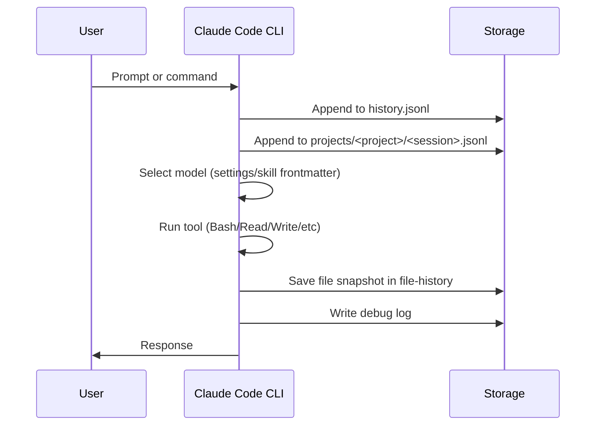
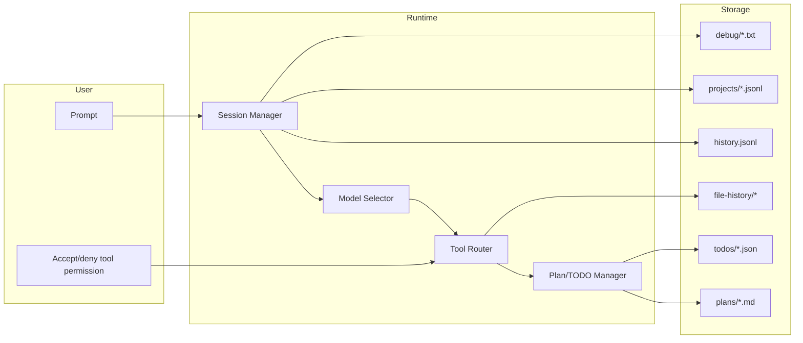
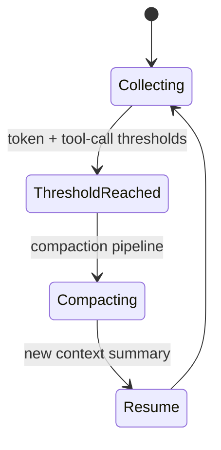
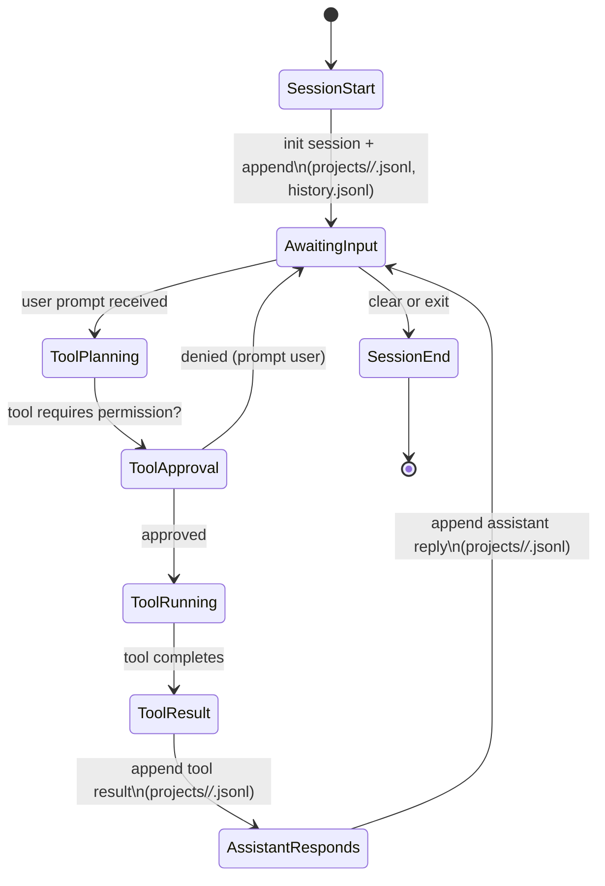

# .claude directory breakdown (for onboarding)

This document explains the structure of `/Users/parkerrex/.claude` as observed in this workspace, with emphasis on agentic architecture, sessions/threads, tool calls, context management, compaction, todos, failure modes, and memory. It is intended as an onboarding guide with concrete file references.

Date of snapshot: 2026-01-14

---

## 1) Executive overview (what this folder is)

`.claude/` is the local state store for Claude Code (CLI). It holds:

- **Configuration and permissions** for the CLI runtime.
- **Per-session and per-project conversation transcripts** in JSONL.
- **Plans, TODOs, and file-history snapshots** created during tool use.
- **Caches and diagnostics** (stats, telemetry, debug logs, shell snapshots).
- **Extensions** (skills, plugins, and marketplaces).

If you are building an agentic system, this directory is a concrete example of how to persist:

- Session IDs and message threads
- Tool execution logs and output traces
- Context window management signals
- Editable artifacts (plans, TODOs, file snapshots)

---

## 2) High-level layout

```
.claude/
  agents/                (empty in this snapshot)
  commands/              (empty in this snapshot)
  skills/                custom skills (SKILL.md files)
  plugins/               plugin config + caches
  projects/              per-project session transcripts (JSONL)
  history.jsonl          global user prompt history
  plans/                 plan files (markdown)
  todos/                 task state (JSON)
  file-history/          file snapshot versions
  debug/                 debug logs (per session)
  telemetry/             failed telemetry events
  stats-cache.json       aggregated usage statistics
  statsig/               feature-gate/config cache
  cache/                 CLI changelog and other caches
  paste-cache/           pasted text snippets
  shell-snapshots/       shell env snapshots
  chrome/                chrome native host wrapper
  ide/                   lock file for IDE integration
  session-env/           per-session env dirs (empty in this snapshot)
  settings.json          CLI settings (hooks, status line, plugins)
  settings.local.json    local permissions overrides
```

---

## 3) Core configuration and policy

### 3.1 `settings.json` (global configuration)

File: `settings.json`

Key sections:

- **Hooks**
  - `Notification`: triggers a macOS notification when Claude is awaiting input.
  - `PostToolUse`: runs `prettier` on `.ts` files after Edit/Write tool actions.

- **Status line**
  - A shell command computes a custom status line, including git branch and dirty state.

- **Enabled plugins**
  - `ralph-wiggum@claude-plugins-official`
  - `swift-lsp@claude-plugins-official`
  - `rust-analyzer-lsp@claude-plugins-official`
  - `code-simplifier@claude-plugins-official`

Why this matters for an agentic system:

- Hooks are a built-in middleware layer: they let you modify tool outputs or enforce formatting without changing agent code.
- Status line scripts show how runtime context (cwd, git state) is surfaced to the UX.

### 3.2 `settings.local.json` (local permissions)

File: `settings.local.json`

This file enforces tool permissions at a granular level. In this snapshot:

- `permissions.allow` includes `Bash(brew:*)`, allowing brew commands without prompting.

This is your “policy layer” for tool execution.

---

## 4) Skills (agentic capability modules)

Directory: `skills/`

Each skill is a self-contained instruction file, typically `SKILL.md`, with frontmatter (name/description) and detailed workflow guidance.

Present skills:

- `skills/explaining-code/SKILL.md`
  - Explains code using an analogy, a diagram, and a step-by-step walkthrough.
- `skills/swiftui-liquid-glass/SKILL.md`
  - Implementation/review guidelines for iOS 26+ Liquid Glass API.
- `skills/swiftui-performance-audit/SKILL.md`
  - Diagnostic workflow for SwiftUI performance issues.
- `skills/youtube-assistant/SKILL.md`
  - A content assistant, with **frontmatter specifying a model** (`model: claude-opus-4-5`).

How this maps to model selection:

- If a skill’s frontmatter declares a model, it becomes a **model override** for that task.
- This is one of the most concrete examples of “model determination system prompting” in the filesystem.

---

## 5) Plugins (tools + integrations)

Directory: `plugins/`

Key files:

- `plugins/installed_plugins.json`
  - Lists installed plugin identifiers, versions, install paths, and timestamps.
- `plugins/known_marketplaces.json`
  - Tracks known plugin marketplaces (here: `anthropics/claude-plugins-official`).
- `plugins/config.json`
  - Repository mapping for marketplaces (empty at the moment).

This is the **tool registry**: a structured place to see which tool bundles are available and how they are sourced.

---

## 6) Sessions, threads, and message storage

### 6.1 Global prompt history

File: `history.jsonl`

This file is a **rolling log of user inputs** across all projects. Each line includes:

- `display`: the raw user prompt or slash command
- `timestamp`: epoch time in ms
- `project`: working directory at time of input
- `pastedContents`: map of pasted content references

Use-case: quick recall, search, or analytics across sessions.

### 6.2 Per-project transcripts

Directory: `projects/`

Project directories are path-encoded. Example:

- `projects/-Users-parkerrex--claude/`

Inside are JSONL files that store conversation turns. Example file:

- `projects/-Users-parkerrex--claude/agent-a02cbe3.jsonl`

Each line is a structured message record with fields like:

- `sessionId`, `uuid`, `parentUuid`
- `agentId` (subagent or tool agent)
- `message` object (role, content, model, usage)
- `timestamp`, `cwd`, `version`

This is the canonical **thread log** for agent sessions.

### 6.3 Session environment

Directory: `session-env/`

This directory contains subfolders named by session UUID. In this snapshot, all are empty, but the directory structure indicates where per-session environment state would be persisted.

---

## 7) Tool call mapping and tool outputs

### 7.1 Where tool execution shows up

Tool calls are recorded in multiple places:

- **Project transcripts** (`projects/.../*.jsonl`): tool results appear as assistant messages with tool metadata in the `message` structure.
- **Debug logs** (`debug/*.txt`): show internal execution and hook application.
- **File history** (`file-history/...`): captures snapshots of files after edits.

### 7.2 Example tool call workflow

1. User prompts in CLI
2. Session is created (JSONL entries)
3. Tool runs (Bash, Read, Write, etc.)
4. PostToolUse hooks apply formatting
5. File snapshots stored in `file-history/`
6. Debug logs record timing + hook results

---

## 8) Plans and TODOs

### 8.1 Plans

Directory: `plans/`

Plan files are markdown (`.md`) with descriptive names. Example:

- `plans/buzzing-discovering-liskov.md`

These plans are used in “plan mode” and store step-by-step execution lists, scope, file targets, and verification steps.

### 8.2 TODOs

Directory: `todos/`

Each file is JSON, keyed by session or agent. Example:

- `todos/0dfb94f0-b454-4bd5-9c0a-bfd9b69c3df4-agent-0dfb94f0-b454-4bd5-9c0a-bfd9b69c3df4.json`

The structure is a list of tasks with status:

```json
[
  {
    "content": "Fix client.tsx provider order and useTRPC export",
    "status": "in_progress",
    "activeForm": "Fixing client.tsx setup"
  }
]
```

This is the **task memory** for an agent run.

---

## 9) File snapshots and “memory” of edits

Directory: `file-history/`

Each session gets its own folder, which contains versioned file snapshots. Example:

- `file-history/0dfb94f0-b454-4bd5-9c0a-bfd9b69c3df4/39a89da569a66e65@v1`

These are literal file contents captured at a point in time. They provide:

- A reproducible record of edits
- A basis for diffing across tool calls
- A recovery mechanism when edits go wrong

The debug logs confirm this behavior (example log line from `debug/075cc22a-16e1-4e60-938b-c337911e4ad2.txt`):

- `FileHistory: Added snapshot ...`

This is effectively **edit memory**.

---

## 10) Context window and compaction

Context management is not stored as a single file, but signals appear in:

- `statsig/statsig.cached.evaluations...`
  - Contains config values such as `minimumMessageTokensToInit`, `minimumTokensBetweenUpdate`, and `toolCallsBetweenUpdates`.
  - These appear to be thresholds for context management updates.

- `cache/changelog.md`
  - Notes multiple compaction and context window fixes (e.g., “Improved compaction reliability”).

This indicates a **feature-gated compaction system** that reacts to token usage thresholds and tool call frequency.

---

## 11) Observability and failure modes

### 11.1 Debug logs

Directory: `debug/`

Files are per-session logs, containing internal state changes, hook matches, and tool execution traces.

Example: `debug/075cc22a-16e1-4e60-938b-c337911e4ad2.txt` shows hook resolution and file-history snapshot creation.

### 11.2 Telemetry failures

Directory: `telemetry/`

File: `telemetry/1p_failed_events.e1fddaf1-89c1-42c9-9d88-677bf17012b4.926689f8-8257-4abc-a6af-c182d11f1f49.json`

This stores telemetry events that failed to send, including event names, models, and environment info.

### 11.3 Stats cache

File: `stats-cache.json`

Aggregated usage stats by day (messages, tool calls, tokens). Useful for capacity planning and performance analysis.

---

## 12) Supporting caches and integrations

- `paste-cache/`:
  - Stores pasted text snippets referenced in prompts.
  - Useful for reconstructing user-provided context.

- `shell-snapshots/`:
  - Captures environment snapshots for shell execution.
  - Files are named `snapshot-zsh-<timestamp>-<id>.sh`.

- `chrome/chrome-native-host`:
  - Wrapper for Chrome integration, launching the Claude Code CLI as a native host.

- `ide/29353.lock`:
  - A lock file indicating IDE integration session state.

---

## 13) Diagrams

### 13.1 Storage map (Mermaid)

```mermaid
flowchart TD
  A[Claude Code CLI] --> B[settings.json]
  A --> C[settings.local.json]
  A --> D[projects/*/*.jsonl]
  A --> E[history.jsonl]
  A --> F[plans/*.md]
  A --> G[todos/*.json]
  A --> H[file-history/*/@v*]
  A --> I[debug/*.txt]
  A --> J[stats-cache.json]
  A --> K[statsig/*]
  A --> L[plugins/*]
  A --> M[skills/*/SKILL.md]
```

### 13.2 Message + tool call sequence (Mermaid)



### 13.3 Swimlane diagram (Mermaid)



### 13.4 Context compaction lifecycle (Mermaid)



---

## 14) How this maps to agentic architecture concerns

### Sessions

- **Session IDs** are the primary unit of continuity.
- Stored in JSONL per project under `projects/`.
- Directory `session-env/` suggests a place for per-session environment data.

### Tool call mapping

- Tools leave traces in three layers:
  1. Transcript JSONL (per project)
  2. File snapshots (`file-history/`)
  3. Debug logs (`debug/`)

### Model determination

- Default model choices are not in a single file, but skill frontmatter can override:
  - Example: `skills/youtube-assistant/SKILL.md` specifies `model: claude-opus-4-5`.
- Plugins can provide tools and possibly agent-specific model defaults.

### Managing context window + compaction

- Feature-gated values appear in `statsig` caches.
- Changelog notes compaction reliability improvements.
- This implies compaction is not just a hard-coded rule but a configurable pipeline.

### TODOs and plans

- Plans are markdown artifacts in `plans/`.
- TODOs are JSON lists in `todos/`.
- These are persistent state layers that survive across tool calls.

### Memory

- **Short-term memory**: current session transcripts in `projects/`.
- **Task memory**: TODO files in `todos/`.
- **Edit memory**: file snapshots in `file-history/`.
- **Long-term memory** (workflow): skills in `skills/` and configuration in `settings.json`.

### Failure modes

- Debug logs and telemetry failure events show failed internal events.
- Hooks can fail or slow; debug logs capture this.
- File snapshots provide rollback capability when tool edits misbehave.

---

## 15) Concrete onboarding steps for a new engineer

1. Start with `settings.json` and `settings.local.json`
   - Understand hooks and permissions, then learn how tools are gated.

2. Inspect one project transcript
   - Example: `projects/-Users-parkerrex--claude/agent-a02cbe3.jsonl`
   - See the message schema and how sessions are structured.

3. Inspect a TODO file and a plan
   - Example TODO: `todos/0dfb94f0-b454-4bd5-9c0a-bfd9b69c3df4-agent-0dfb94f0-b454-4bd5-9c0a-bfd9b69c3df4.json`
   - Example plan: `plans/buzzing-discovering-liskov.md`

4. Review file snapshots
   - Example: `file-history/0dfb94f0-b454-4bd5-9c0a-bfd9b69c3df4/39a89da569a66e65@v1`

5. Check observability
   - Debug logs: `debug/075cc22a-16e1-4e60-938b-c337911e4ad2.txt`
   - Telemetry failures: `telemetry/1p_failed_events...json`

---

## 16) Summary: What this teaches us about building agentic systems

- **Separate raw conversation data from derived artifacts** (plans, TODOs, file snapshots).
- **Persist tool side effects** with independent audit trails.
- **Make model selection explicit** in the skill/module layer.
- **Expose hooks as a middleware layer** for post-processing and guardrails.
- **Instrument everything** (debug logs, stats cache, telemetry failures).

If you want, I can also produce a second version tailored for your team’s internal agent framework, mapping these concepts directly to your architecture.

---

## 16.1) How Claude does it (implementation patterns only)

This section strips away onboarding advice and focuses on how Claude Code actually implements sessioning, tools, context, and memory in the filesystem.

### Sessions + threads

- **Session identity** is encoded in filenames and folder names (UUIDs) under `projects/`, `debug/`, `todos/`, and `file-history/`.
- **Thread structure** is stored in JSONL records with `uuid` and `parentUuid` fields in `projects/*/*.jsonl`.
- **Global prompt history** is centralized in `history.jsonl` for fast recall across sessions.

### Tool call mapping

Claude keeps **three parallel traces**:

1. **Transcript trace** (what the assistant/user said and tool results): `projects/*/*.jsonl`\n2. **Edit trace** (what changed): `file-history/*/@v*`\n3. **Runtime trace** (how the tool executed): `debug/*.txt`

This separation makes tool execution auditable and debuggable even if a session transcript is compacted.

### Model selection

- Skill frontmatter can **pin a model** per capability (see `skills/youtube-assistant/SKILL.md` with `model: claude-opus-4-5`).
- This implies **model routing is declarative** at the skill layer, not hardcoded in runtime logic.

### Context window + compaction

- Feature-gated thresholds appear in `statsig/statsig.cached.evaluations.*` (e.g., minimum tokens before updates, tool call intervals).\n- Changelog entries in `cache/changelog.md` indicate ongoing improvements to compaction reliability.\n- Net effect: **compaction is policy-driven**, not fixed, and likely varies by feature gate/config.

### Memory layers (as persisted by Claude)

- **Short-term**: session transcripts (`projects/`).\n- **Task memory**: TODO state (`todos/`).\n- **Planning memory**: plans (`plans/`).\n- **Edit memory**: file snapshots (`file-history/`).\n- **Behavioral memory**: skills (`skills/`) and policies (`settings.json`).

### Failure handling + observability

- **Operational logging** is per-session in `debug/`.\n- **Failed telemetry** is preserved in `telemetry/`.\n- **Usage stats** are aggregated in `stats-cache.json` (message/tool/token counts by day).

### Policy + safety

- Tool permissions and hooks live in `settings.json` and `settings.local.json`.\n- Hooks are used as **post-tool middleware** (e.g., formatting via `prettier`).

### Claude’s storage strategy in one view

```mermaid
flowchart LR
  A[Session runtime] --> B[projects/*.jsonl]
  A --> C[history.jsonl]
  A --> D[debug/*.txt]
  A --> E[file-history/*/@v*]
  A --> F[todos/*.json]
  A --> G[plans/*.md]
  A --> H[stats-cache.json]
  A --> I[statsig/*]
  A --> J[settings.json]
  A --> K[skills/*/SKILL.md]
```

---

## 16.2) Requested diagrams (Claude-specific internals)

### 1) Session JSONL event type diagram (state machine + log append flow)

This diagram combines a session state machine with the log append flow Claude uses to persist events in JSONL.



```mermaid
flowchart TD
  U[User input] --> H[history.jsonl append]
  U --> P[projects/<project>/<session>.jsonl append]
  P --> A[Assistant message records\n(type=user/assistant/tool)]
  A --> D[debug/<session>.txt traces]
  A --> F[file-history/<session>/@v* snapshots\n(only if edits happen)]
```

### 2) Failure mode taxonomy (symptoms → files)

This diagram maps observable symptoms to the most likely files/directories that contain evidence.

```mermaid
flowchart LR
  subgraph Symptoms
    S1[Tool output missing]
    S2[Unexpected edit]
    S3[Permission prompt loop]
    S4[Model mismatch]
    S5[Context truncation]
    S6[Slow or stuck tool]
  end

  subgraph Evidence Files
    E1[projects/*/*.jsonl]
    E2[debug/*.txt]
    E3[file-history/*/@v*]
    E4[settings.json]
    E5[settings.local.json]
    E6[statsig/*]
    E7[cache/changelog.md]
    E8[telemetry/*.json]
  end

  S1 --> E1
  S1 --> E2
  S2 --> E3
  S2 --> E2
  S3 --> E4
  S3 --> E5
  S4 --> E1
  S4 --> E6
  S5 --> E6
  S5 --> E7
  S6 --> E2
  S6 --> E8
```

### 3) Tool call lifecycle swim-lane (with approvals + snapshots)

This swim-lane shows the sequence of a tool call with user approval gates and snapshot capture.

```mermaid
flowchart LR
  subgraph User
    U1[Prompt]
    U2[Approve/Deny]
    U3[See response]
  end

  subgraph Runtime
    R1[Parse + plan]
    R2[Permission check]
    R3[Tool execute]
    R4[PostToolUse hooks]
    R5[Compose response]
  end

  subgraph Storage
    S1[history.jsonl]
    S2[projects/*.jsonl]
    S3[file-history/*/@v*]
    S4[debug/*.txt]
  end

  U1 --> R1 --> R2
  R2 --> U2
  U2 --> R3
  R3 --> R4 --> R5 --> U3

  R1 --> S1
  R1 --> S2
  R3 --> S4
  R4 --> S3
  R5 --> S2
```

---

## 17) Team onboarding checklist (roles + ownership)

Use this checklist to onboard new engineers by role. It ties each role to the specific files/directories that matter most.

### Platform/Infra engineer

- Confirm runtime policies and hooks
  - Review `settings.json` (hooks, status line, enabled plugins).
  - Review `settings.local.json` (tool permissions, allow/deny rules).
- Validate storage layout and retention
  - Walk through `projects/`, `history.jsonl`, `file-history/`, `todos/`, `plans/`.
- Establish operational hygiene
  - Decide rotation/retention for `debug/`, `telemetry/`, `shell-snapshots/`, `paste-cache/`.
- Confirm toolchain integrity
  - Check `plugins/installed_plugins.json` and `plugins/known_marketplaces.json`.

### Agent/runtime engineer

- Understand session/thread schema
  - Read a session JSONL in `projects/` to see message/parent/usage structure.
- Understand tool call lifecycle
  - Map tool calls to file snapshots in `file-history/` and logs in `debug/`.
- Understand model selection overrides
  - Inspect skill frontmatter in `skills/*/SKILL.md` (look for `model:` fields).

### Product/UX engineer

- Understand how plan/TODO state is represented
  - Review a plan in `plans/` and a TODO JSON in `todos/`.
- Understand how prompts are replayed or searched
  - Scan `history.jsonl` to see command/prompt history records.

### Security/Compliance engineer

- Identify sensitive stores
  - `history.jsonl`, `projects/`, `telemetry/`, `statsig/`, `paste-cache/`.
- Define redaction or encryption policies
  - Ensure secrets are not stored in cleartext logs or caches.
- Review hooks that execute system commands
  - `settings.json` hooks (e.g., PostToolUse formatting commands).

### Team lead / onboarding owner (one-time setup)

- Decide which folders are **shareable vs. private**
  - Private: `history.jsonl`, `projects/`, `telemetry/`, `statsig/`.
  - Shareable: `skills/`, selected `settings.json` baseline, `plugins/` (minus caches).
- Create a starter pack
  - A minimal `.claude` skeleton: `settings.json`, `skills/`, `plugins/known_marketplaces.json`.

---

## 18) Threat model + privacy appendix (sensitive data map)

This section calls out where sensitive data can appear and how to mitigate risk.

### 18.1 Data sensitivity map

- **High sensitivity**
  - `history.jsonl`: raw user prompts, often includes secrets or proprietary text.
  - `projects/*/*.jsonl`: full conversation transcripts, tool outputs, potential secrets.
  - `paste-cache/*.txt`: pasted content (can include credentials or snippets).

- **Medium sensitivity**
  - `debug/*.txt`: operational logs; may contain file paths or error traces.
  - `telemetry/*.json`: environment data, model IDs, session IDs, device ID.
  - `statsig/*`: feature-gate config, includes IP-derived data and account UUIDs.

- **Lower sensitivity**
  - `plans/*.md`, `todos/*.json`: task descriptions (still sensitive to roadmap info).
  - `file-history/*`: snapshots of edited files (sensitive if codebase is private).
  - `plugins/*`: plugin metadata; may reveal usage but not content.

### 18.2 Failure modes to watch

- **Secret leakage via logs**
  - Tools can inadvertently log secrets into transcripts or debug logs.
- **Unsafe shell hooks**
  - Hooks in `settings.json` execute shell commands; misconfiguration is a risk.
- **Snapshot exposure**
  - `file-history/` stores full file contents, including secrets if they exist in files.

### 18.3 Recommended controls

- **Retention policy**
  - Rotate or purge `history.jsonl`, `projects/`, and `paste-cache/` on a schedule.
- **Access controls**
  - Ensure `.claude/` is user-only readable (permissions 0700 on directories).
- **Redaction pipeline**
  - Add a hook to scrub tokens, API keys, or known secret patterns before logging.
- **Plugin governance**
  - Only install plugins from trusted marketplaces; review `plugins/installed_plugins.json`.
- **Environment hygiene**
  - Avoid running Claude Code in directories with secrets unless necessary.

### 18.4 Safe sharing guidelines

- Before sharing `.claude/` content with teammates or external partners:
  - Remove `history.jsonl` and `projects/`.
  - Remove `telemetry/` and `statsig/`.
  - Remove `paste-cache/` and `debug/`.
  - Keep `skills/` and sanitized `settings.json` if you want to share behaviors.

---
