# .codex Architecture & Onboarding Guide

This document explains how this `.codex` directory is structured, how it handles messages/threads, tools, prompting, memory, and context compaction. It is written to onboard new team members quickly with concrete file references.

> Scope note: This write‑up is grounded in files present in `/Users/parkerrex/.codex`. When a concept is architectural rather than explicitly implemented here (e.g., model‑side compaction internals), it is labeled as such.

---

## 1) Quick map of the repo

At a high level, the `.codex` directory is a control plane and state store for the Codex CLI/agent runtime. It separates **configuration**, **prompts/skills**, and **runtime logs/state**.

```
.codex/
├── config.toml                # Core model/tool config + feature flags
├── rules/default.rules        # Allowlist rules for command execution
├── prompts/                   # Slash-command prompt templates
├── skills/                    # Skill packs + metadata + docs
├── sessions/                  # Active session logs (JSONL, by date)
├── archived_sessions/         # Historical sessions (JSONL)
├── history.jsonl              # Global interaction history (JSONL)
├── shell_snapshots/           # Command/script snapshots
├── log/codex-tui.log           # TUI runtime log
├── internal_storage.json      # Small persistent flags (e.g., prompt seen)
├── auth.json                  # Auth/credentials (treat as secret)
├── version.json               # Update tracking for Codex
└── notify.py                  # Local notification helper
```

**Mental model:**
- **`config.toml`** is the “system settings” for the agent.
- **`rules/` + `prompts/` + `skills/`** shape how the agent plans and acts.
- **`sessions/`, `history.jsonl`, `log/`, `shell_snapshots/`** are the *observability layer*.

---

## 2) Core orchestration & configuration

### `config.toml` (the control plane)
Key items in `config.toml`:
- **Model selection**: `model = "gpt-5.2-codex"` and `model_reasoning_effort = "xhigh"`.
- **Context & tool output budget**: `tool_output_token_limit = 25000` and `model_auto_compact_token_limit = 233000` with a comment showing the formula that preserves room for compaction near a ~272–273k context window.
- **Feature flags** in `[features]`:
  - `unified_exec = true` → centralized shell execution pipeline.
  - `apply_patch_freeform = true` → supports `apply_patch` in freeform format.
  - `web_search_request = true`, `skills = true`, `shell_snapshot = true`.
- **Tool backends (MCP servers)** in `[mcp_servers.*]`:
  - `XcodeBuildMCP` and `firecrawl-mcp` are launched via `npx`.
  - Environment variables are set here (e.g., API keys). **Do not commit or share raw values**.
- **Trust scopes** in `[projects."..."]` mark locations as `trusted`.
- **Notices** under `[notice]` adjust CLI behavior (e.g., suppressing nudges).

#### Architecture layers (repo vs runtime)
```mermaid
flowchart TB
  subgraph Repo[.codex directory]
    C[config.toml]
    R[rules/default.rules]
    P[prompts/*]
    K[skills/*]
    L[sessions/ + history.jsonl]
  end
  subgraph Runtime[Codex CLI runtime]
    M[Model runtime]
    X[Unified exec harness]
    G[Compaction engine]
    T[Tool adapters (MCP)]
  end
  C --> M
  C --> T
  R --> X
  P --> M
  K --> M
  M --> L
  X --> L
  G --> L
```

### `rules/default.rules` (execution guardrails)
This file is a **prefix allowlist**: specific command patterns that can be executed automatically (or with less friction). It protects against unsafe or unexpected operations. The contents are intentionally long and specific, so the agent can run known-safe commands without re-asking for approval.

**Onboarding takeaway:** treat this as the “policy firewall” between the model and the shell. Add new allow rules only when you have a repeatable, safe pattern.

### `prompts/` (slash-command templates)
These are reusable workflows that the agent can invoke as `/acceptpr`, `/handoff`, `/pickup`, and `/raise`. They encode checklists and guardrails for high‑risk workflows. See:
- `prompts/README.md` (index)
- `prompts/acceptpr.md`
- `prompts/handoff.md`
- `prompts/pickup.md`
- `prompts/raise.md`

### `skills/` (modular agent capabilities)
`skills/` contains self‑documenting skill packs (`SKILL.md` + references + scripts). Examples:
- `skills/Skills/ios-debugger-agent/SKILL.md` → iOS simulator workflow.
- `skills/Skills/gh-issue-fix-flow/SKILL.md` → end‑to‑end GitHub issue fix.
- `skills/Skills/app-store-changelog/SKILL.md` → release notes generation.
- `skills/ask-questions-if-underspecified/SKILL.md` → clarification behavior.

There is also a documentation site scaffold under `skills/Skills/docs/` and a helper script `skills/Skills/scripts/build_docs_index.py`.

---

## 3) How messages, sessions, and threads are represented

### Files involved
- `sessions/YYYY/MM/DD/*.jsonl` → active/ongoing sessions (daily partitioned).
- `archived_sessions/*.jsonl` → older sessions, archived by rollout.
- `history.jsonl` → global interaction log (across sessions).
- `shell_snapshots/*.sh|*.zsh` → snapshots of executed shell commands.
- `log/codex-tui.log` → runtime log for the CLI UI.

### Session lifecycle (conceptual)
Sessions are stored as **JSONL** (one JSON object per line). The naming pattern (`rollout-YYYY-MM-DDTHH-MM-SS-<id>.jsonl`) indicates a run/rollout timestamp and a unique id. This is a typical architecture for agent logs: append‑only, line‑oriented, easy to stream or parse.

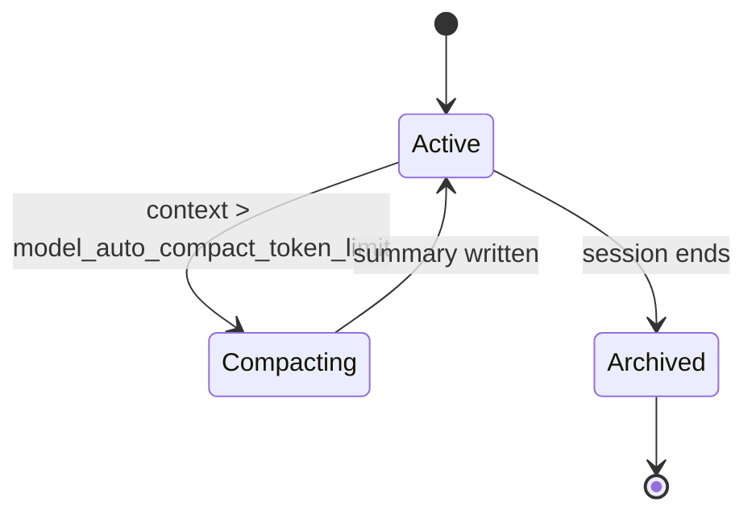

### Session event append flow (conceptual)
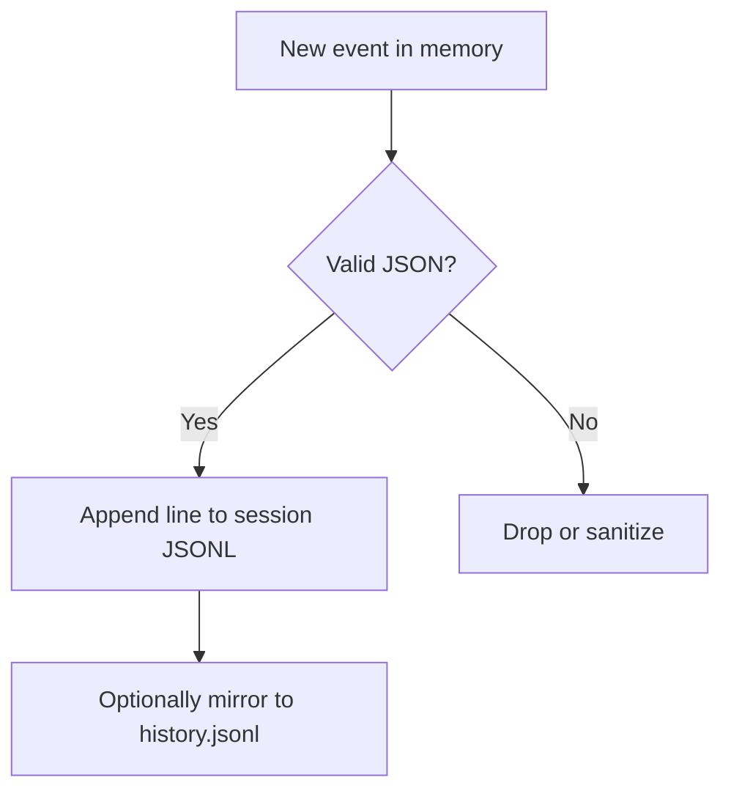

### Event type lifecycle (schema‑agnostic)
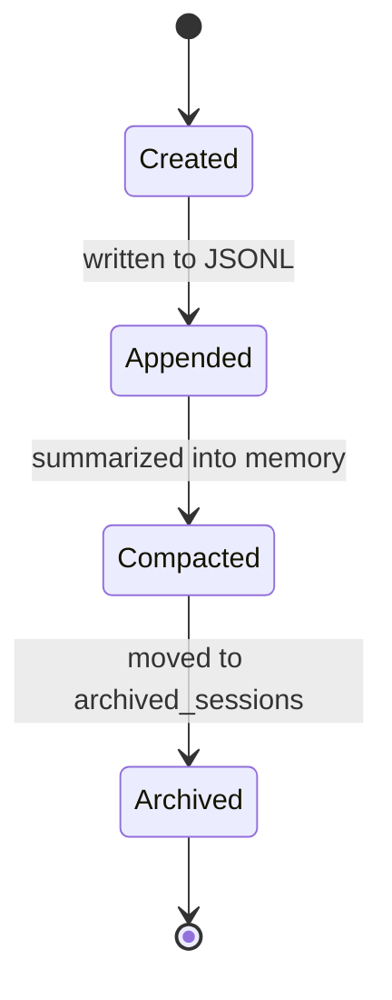

**Why JSONL?** It enables streaming writes and partial reads without corrupting the file. This is a standard practice in agent runtimes and logging pipelines.

---

## 4) Tool call mapping: from request to execution

The tool pipeline is governed by configuration, rules, and the execution harness.

### Key artifacts
- **Tool registration**: `config.toml` → `[mcp_servers.*]` entries.
- **Execution policy**: `rules/default.rules` → allowlist prefixes.
- **Unified execution**: `config.toml` → `features.unified_exec = true`.
- **Outputs & logs**: `shell_snapshots/`, `sessions/`, `log/codex-tui.log`.

### End‑to‑end tool call flow
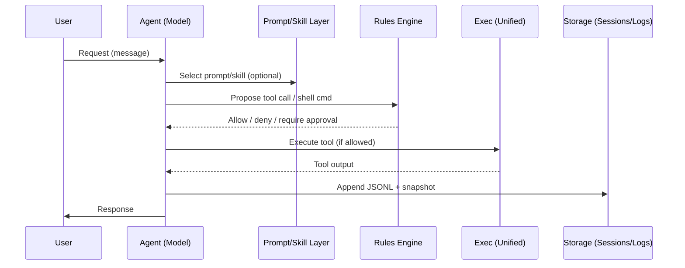

### Tool call lifecycle (swim‑lane)
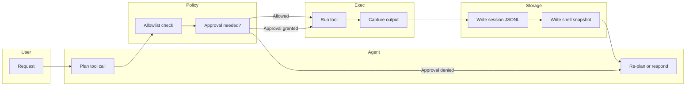

### Tool gating decision tree
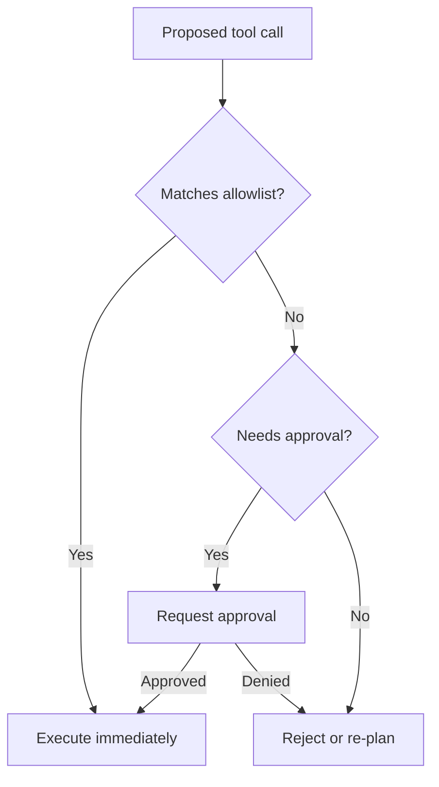

### Swim‑lane view (roles separated)
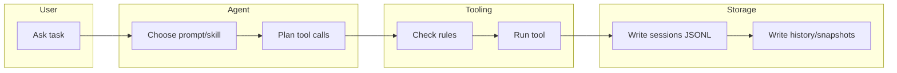

**Practical takeaway:** If tool calls are failing, inspect `rules/default.rules` (policy), `config.toml` (tool registration), and `log/codex-tui.log` (runtime errors).

---

## 5) Model determination & system prompting

### What’s explicit here
- **Model + reasoning effort** are set in `config.toml`.
- **Prompting** is influenced by:
  - `prompts/*.md` (slash commands)
  - `skills/*/SKILL.md` (skill activation rules and workflows)
  - `internal_storage.json` (small flags like `gpt_5_codex_model_prompt_seen`)

### What’s inferred (common agent pattern)
There is no explicit “model router” code in this directory. The configuration implies a **single, pinned model** for this workspace. Any dynamic model selection would have to be implemented in the CLI runtime or an upstream controller (outside this repo).

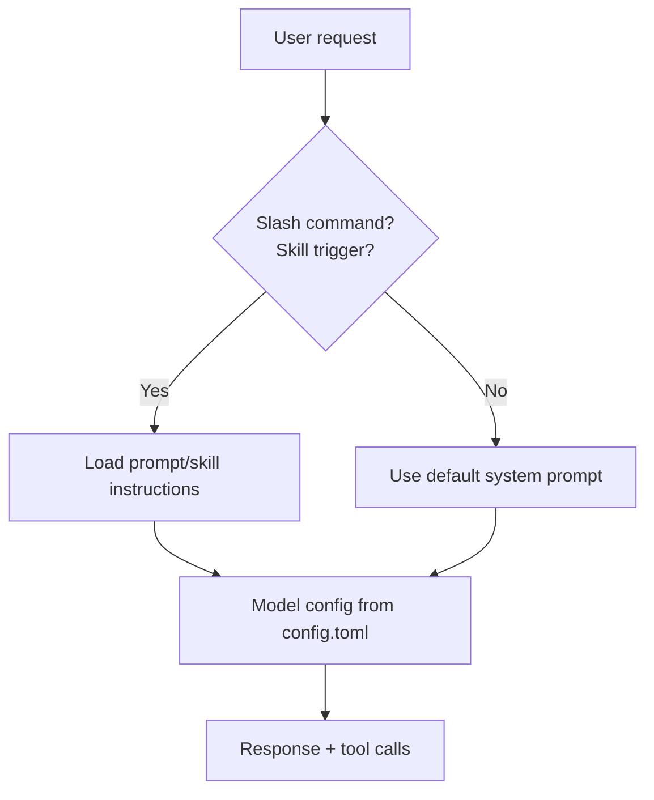

### Prompt/skill activation map
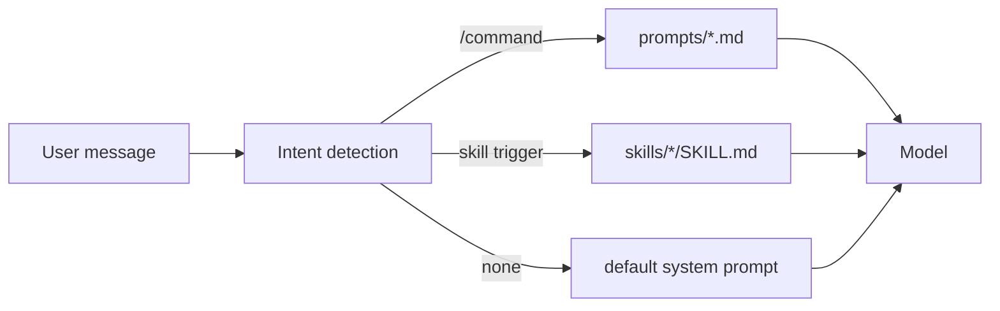

---

## 6) Context window management & compaction

### What you can see in this repo
`config.toml` contains:
- `tool_output_token_limit = 25000` → bounds tool output so it can fit in the context window.
- `model_auto_compact_token_limit = 233000` → triggers compaction when exceeded.
- A comment with the formula to keep compaction room around a ~273k window.

### What compaction means (conceptual)
Compaction is a **controlled summarization step** that compresses older context into a shorter, stable memory so new turns can fit. This is handled by the runtime/model, not a file in this repo.

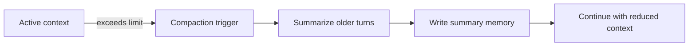

### Context budget visualization
```mermaid
flowchart LR
  T[Tool output limit\n(25k tokens)] --> W[Context window (~273k)]
  R[Reserved headroom\n(15k)] --> W
  C[Compaction trigger\n(233k)] --> W
```

**Practical takeaway:** The key tuning knobs are in `config.toml`. If you see context overflow, reduce tool output limits or lower the compaction threshold.

---

## 7) Memory and persistence

### Persistent state in this directory
- `internal_storage.json` → small flags (currently `gpt_5_codex_model_prompt_seen`).
- `history.jsonl` → global interaction history.
- `sessions/` + `archived_sessions/` → session-scoped logs.

### Credentials and secrets
- `auth.json` exists and should be treated as **sensitive**. Do not share or commit its contents.
- `config.toml` may include API keys in env vars; those should be **redacted** in docs or screenshots.

### What this implies for “memory”
Memory is split between:
1) **Structured persistence** (JSONL logs, flags)
2) **Context window memory** (what the model sees each turn)

**Onboarding note:** If you want “long‑term memory,” the pattern is to store durable summaries or artifacts in a known file (e.g., `memory/` or a DB). This repo currently relies on session/history logs and compaction, not a dedicated semantic memory store.

### Memory tiers (conceptual)
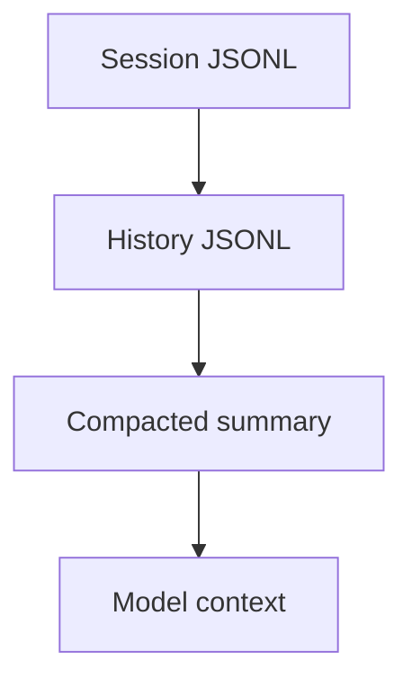

### Context compaction vs history persistence (layered view)
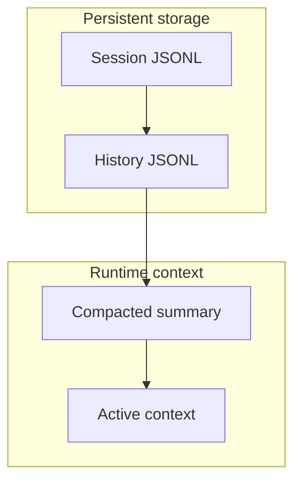

---

## 8) Agents vs. subagents (as represented here)

There is no explicit “subagent” runtime in this directory. Instead, **skills** act like *subagent playbooks*:
- A **skill** is a structured workflow (instructions, constraints, tools) in `skills/*/SKILL.md`.
- Skills can reference scripts or templates (e.g., `skills/Skills/scripts/...`).
- The system message or AGENTS instructions (outside this folder) activate a skill when needed.

**Practical framing:**
- **Agent** = the active model + runtime + policy rules.
- **Subagent** = a specialized skill workflow executed by the same agent.

If you need true subagent concurrency, that would be implemented in the runner/orchestrator (not visible here).

---

## 8.1) What Codex does vs what this folder shows

What is **explicitly visible** in `.codex`:
- A **single, pinned model** configuration (`config.toml`).
- A **tool execution harness** guarded by an allowlist (`rules/default.rules`) and a unified exec pipeline.
- **Prompt/skill workflows** for scoped behaviors (`prompts/`, `skills/`).
- **Session/history storage** as JSONL logs (`sessions/`, `history.jsonl`, `archived_sessions/`).

What is **not visible here** (likely implemented in the Codex CLI runtime):
- Internal **thread routing** or multi-agent orchestration logic.
- The **compaction algorithm** and how summaries are generated.
- The **message schema** beyond top-level JSONL keys.

Inference (based on artifacts, not code):
- Codex behaves as a **single-agent controller** with modular skills and strict command gating.
- The **session file** is effectively the thread boundary; tools and messages append to it.

### Codex operational model (high level)
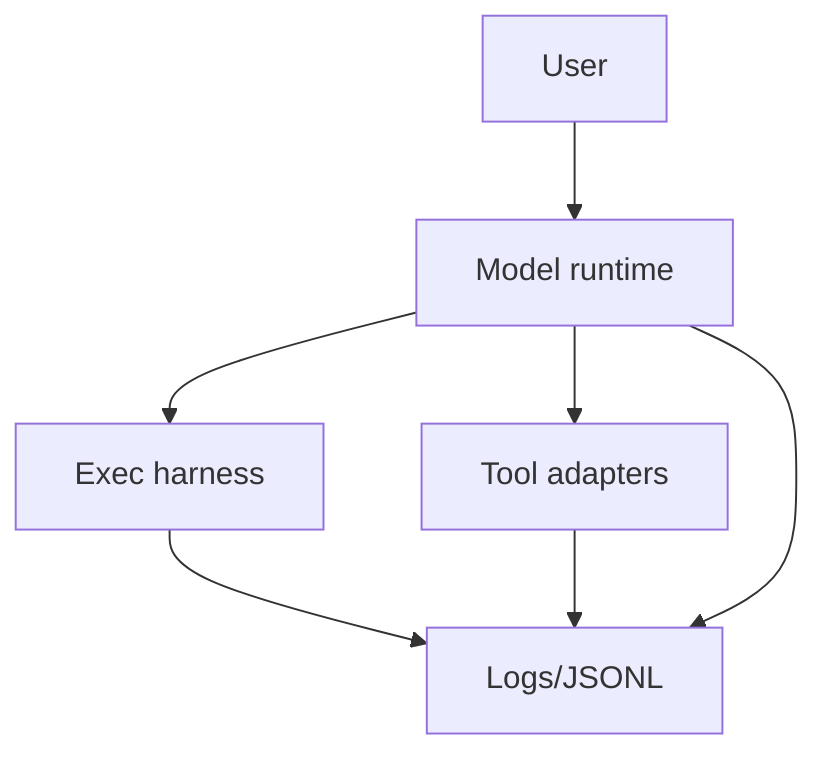

### Thread boundary vs session file
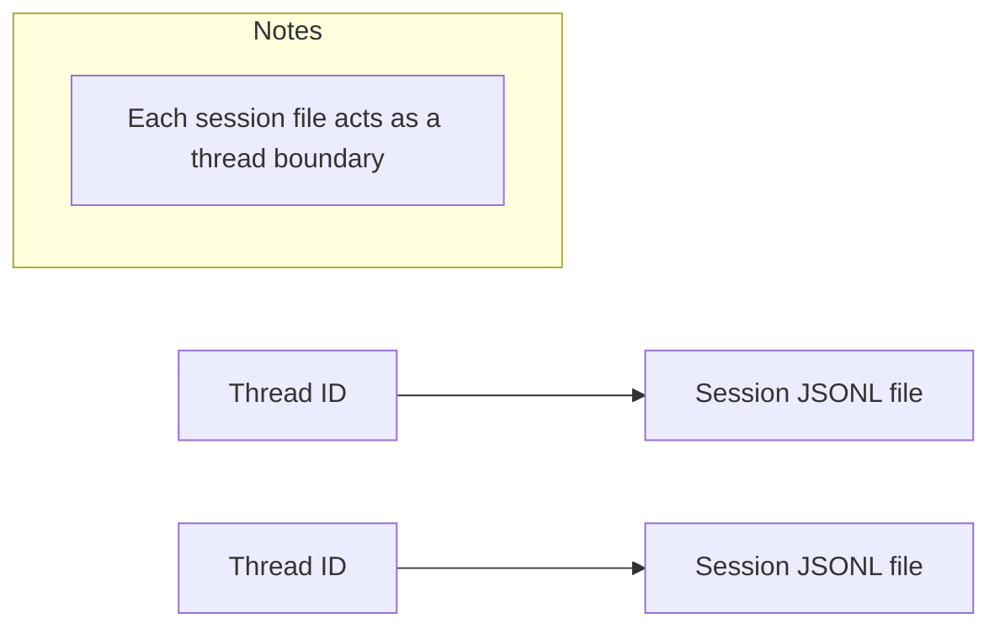

### Skills execution pipeline
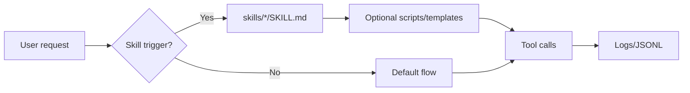

---

## 9) Failure modes (and where to look)

Common failure categories and the files to inspect:

1) **Tool execution denied**
   - Check `rules/default.rules` for missing allowlist patterns.

2) **Tool not found / not registered**
   - Check `config.toml` → `[mcp_servers.*]` entries.

3) **Context overflow**
   - Check `config.toml` → `tool_output_token_limit` and `model_auto_compact_token_limit`.
   - Inspect `sessions/` logs for repeated truncation patterns.

4) **Skill not triggering**
   - Inspect the relevant `skills/*/SKILL.md` for trigger wording.

5) **Inconsistent behavior across runs**
   - Inspect `sessions/` vs `archived_sessions/` and `history.jsonl` for drift.

6) **TUI or harness issues**
   - Check `log/codex-tui.log`.

### Failure mode taxonomy (symptom → likely file)
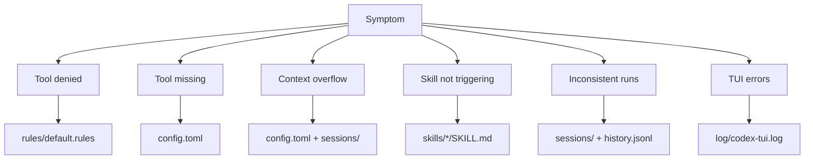

---

## 10) How to scaffold an agentic codebase using this as a template

Below is a recommended minimal structure inspired by this repo:

```
my-agentic-system/
├── config.toml              # model/tool config + limits
├── rules/                   # execution policy
│   └── default.rules
├── prompts/                 # reusable workflows
├── skills/                  # modular capabilities
├── sessions/                # active session logs
├── archived_sessions/       # archived logs
├── history.jsonl            # global history
├── internal_storage.json    # flags/feature gates
├── log/                     # runtime logs
└── tools/                   # tool implementations (if local)
```

### Suggested onboarding checklist
1) **Model config**: set model, reasoning effort, tool output limit, compaction limit.
2) **Policy**: add allowlist rules for safe commands.
3) **Prompts**: add at least `/handoff`, `/pickup`‑style workflows.
4) **Skills**: create 2–5 core skills covering your most frequent tasks.
5) **Logging**: ensure session and history logs are written in JSONL.
6) **Secrets**: centralize secrets in config/env and redact in docs.

---

## 11) Important file callouts (fast reference)

| Path | Role | Notes |
| --- | --- | --- |
| `config.toml` | Core model/tool config | Model, tool limits, feature flags, MCP servers, trust scope |
| `rules/default.rules` | Execution allowlist | Prefix rules for allowed commands |
| `prompts/README.md` | Slash‑command index | Where prompt templates live |
| `prompts/acceptpr.md` | PR landing workflow | Rebase merge, lint, changelog |
| `prompts/handoff.md` | Handoff checklist | Captures state for next agent |
| `prompts/pickup.md` | Pickup checklist | Rehydrate context + next steps |
| `prompts/raise.md` | Changelog bump | Opens next Unreleased patch |
| `skills/*/SKILL.md` | Skill definitions | Modular workflows + triggers |
| `skills/Skills/docs/` | Skill docs site | Static docs + assets |
| `internal_storage.json` | Persistent flags | Small state (e.g., prompt seen) |
| `sessions/` | Active session logs | JSONL, date‑partitioned |
| `archived_sessions/` | Archived session logs | JSONL, rollout‑named |
| `history.jsonl` | Global history | Append‑only JSONL |
| `shell_snapshots/` | Shell command snapshots | Useful for reproducing runs |
| `log/codex-tui.log` | Runtime log | TUI/harness diagnostics |
| `auth.json` | Auth credentials | Sensitive, do not share |
| `version.json` | Update tracking | Latest version + last check |
| `notify.py` | Local notifier | Uses `terminal-notifier` |

---

## 12) FAQ‑style explanations for onboarding

**Q: Where do sessions live, and how do we “thread” them?**
- Sessions are stored as JSONL in `sessions/` (active) and `archived_sessions/` (old). Threading is implicit: a session file acts like a thread log.

**Q: How are tools wired up?**
- Tools are declared in `config.toml` under `[mcp_servers.*]` and run through a unified execution pipeline. Safety is enforced via `rules/default.rules`.

**Q: How is the context window managed?**
- The compaction threshold and tool output cap are defined in `config.toml`. Compaction itself is handled by the runtime/model, not in this repo.

**Q: Do we have long‑term memory?**
- Not in a semantic store. The system relies on JSONL logs and compaction summaries. If long‑term memory is needed, add a dedicated store.

**Q: What’s the difference between agents and subagents here?**
- “Subagent” behavior is modeled as **skills**. There is no parallel subagent runtime in this directory.

---

## 13) Recommended next improvements (optional)

If you want to push this repo toward a more explicit agentic architecture:
- Add a `memory/` folder for curated summaries or stable facts.
- Add `tools/` with local tool descriptors or wrapper scripts.
- Add a `schema/` folder documenting JSONL formats for sessions/history.
- Add a `diagrams/` folder with auto‑rendered Mermaid exports.

---

## Appendix: How to read JSONL logs safely

When onboarding, avoid opening logs with secrets or user data unless necessary. If you do need schema hints, parse just the keys and counts, not values.

Example (safe) approach:
- Count lines: `wc -l sessions/2026/01/14/*.jsonl`
- Print top‑level keys only (no values)

---

## Appendix: Observed JSONL key schema (sampled)

This is a **safe, schema‑only** snapshot of *top‑level keys* observed from a limited sample (first 200 lines) of recent session files and `history.jsonl`. This intentionally avoids any values or user content.

Sampled files:
- `sessions/2026/01/14/rollout-2026-01-14T00-14-13-019bbaed-0427-7563-92aa-e4f7aed57553.jsonl`
- `sessions/2026/01/14/rollout-2026-01-14T00-48-24-019bbb0c-5008-7bd2-a600-b34f54835464.jsonl`
- `sessions/2026/01/14/rollout-2026-01-14T10-06-14-019bbd0b-051c-7011-9e49-67b2b6fc6b06.jsonl`
- `sessions/2026/01/14/rollout-2026-01-14T10-55-58-019bbd38-8c1e-7322-b5f0-e6d60190554c.jsonl`
- `sessions/2026/01/14/rollout-2026-01-14T11-16-43-019bbd4b-8bdb-7a52-9c26-dd684efe3ee4.jsonl`
- `archived_sessions/rollout-2025-10-10T15-03-28-0199cf81-b684-7fa1-aa25-3c0972700b38.jsonl`
- `archived_sessions/rollout-2025-10-16T10-23-11-0199ed67-43ce-73e0-9b02-ced6abf37fef.jsonl`
- `history.jsonl`

Observed top‑level keys:
- `timestamp`
- `type`
- `payload`
- `session_id`
- `ts`
- `text`

Notes:
- The presence of both `timestamp` and `ts`, and both `payload` and `text`, suggests **multiple event schemas** or versions across logs.
- If you need a formal schema, add a `schema/` folder and codify the event shapes per log type (e.g., `history`, `session`, `tool`, `assistant`).

---

End of document.
