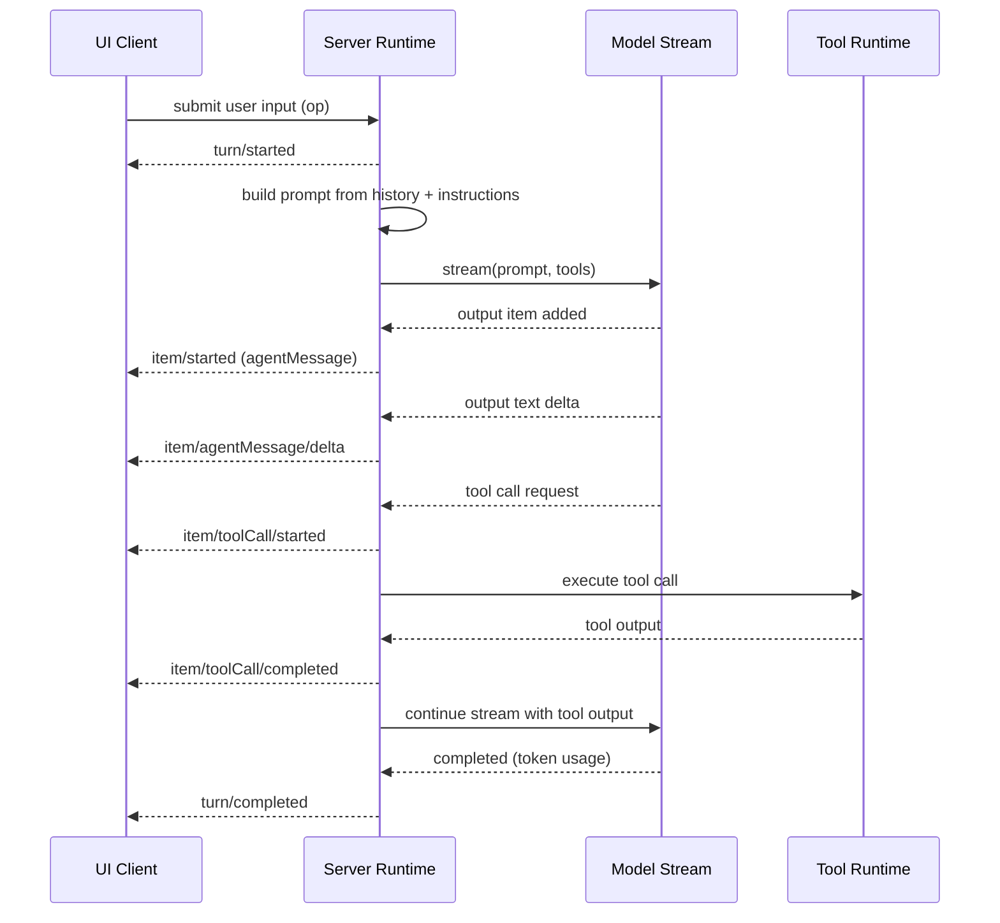

# Core Runtime (Threads, Sessions, Turns)

This subsystem is the heart of Codex: it owns threads, sessions, the turn loop,
and the event stream that frontends render. This document expands on how the
runtime works so you can mirror the architecture in Next.js/React or any other
stack.

## Threads, sessions, turns (ownership model)

- Thread: externally exposed conversation handle.
  - `codex-rs/core/src/thread_manager.rs` creates threads and stores them in memory.
  - `codex-rs/core/src/codex_thread.rs` exposes a lightweight handle for ops/events.
- Session: internal stateful agent runtime for a thread.
  - `codex-rs/core/src/codex.rs` (struct `Session`)
  - Owns history, features, services (MCP, exec policy), and the active turn.
- Turn: one cycle of prompt -> model response(s) -> tools -> completion.
  - `codex-rs/core/src/codex.rs` (`run_turn`, `run_model_turn`, `try_run_turn`)

## Response items (canonical transcript)

History is recorded as `ResponseItem` values (model API shapes). Tools and
messages are normalized into a single timeline.

- `codex-rs/protocol/src/models.rs` - `ResponseItem` and content structures.
- `codex-rs/core/src/context_manager/history.rs` - in-memory storage.
- `codex-rs/core/src/event_mapping.rs` - parses `ResponseItem` into `TurnItem`
  for UI/event rendering.

The canonical transcript is the source of truth used to:
- build the next model prompt,
- rebuild UI state from events,
- and persist/rehydrate a conversation.

## Events + ops (client <-> core contract)

- `codex-rs/protocol/src/protocol.rs` defines `Op` (requests) and `Event` (responses).
  Examples: `Op::Compact`, `Op::Undo`, `Op::ThreadRollback`, `Op::ListSkills`,
  `Op::RunUserShellCommand`.

The CLI TUI consumes `EventMsg` directly; app-server clients receive JSON-RPC
notifications with analogous payloads. See
`../subsystems/server-to-tui-event-pipeline.md`.

## Turn loop: step-by-step

Primary implementation: `codex-rs/core/src/codex.rs` (`run_turn`,
`run_model_turn`, `try_run_turn`).

1) **Auto-compaction check**
   - If accumulated token usage exceeds model limits, auto-compaction runs
     before starting the turn. `run_auto_compact` decides local vs remote.
2) **TurnStarted event**
   - The session emits `EventMsg::TurnStarted` with the model context window.
3) **Skill discovery + injection (optional)**
   - Skills for the current working directory are collected, warnings are
     emitted, and injected items are recorded into history.
4) **Record initial user input**
   - The incoming user message(s) are normalized to `ResponseItem` and added
     to history.
5) **Build model prompt**
   - The prompt is built from history and turn context (base instructions,
     developer instructions, user instructions, truncation policy, output schema).
6) **Stream model output**
   - `run_model_turn` opens a streaming response from the model.
   - Each streaming event is handled and turned into UI events and/or history.
7) **Tool calls**
   - Tool specs are constructed from local tool config + MCP tools.
   - Tool calls are executed by `ToolCallRuntime`.
   - Tool outputs are recorded as `ResponseItem` and can trigger a follow-up
     turn if needed.
8) **Completion or follow-up**
   - On `ResponseEvent::Completed`, token usage is updated.
   - If pending input exists or tool calls require follow-up, the loop repeats.

## Streaming output lifecycle (what the runtime emits)

Streaming is handled in `try_run_turn` and turns model events into
`EventMsg` for frontends and `ResponseItem` for history.

Key response events handled:
- `ResponseEvent::OutputItemAdded` -> start of a new UI item.
- `ResponseEvent::OutputItemDone` -> finalize item; may enqueue tool call.
- `ResponseEvent::OutputTextDelta` -> assistant text streaming delta.
- `ResponseEvent::ReasoningSummaryDelta` / `ReasoningContentDelta` ->
  reasoning streaming deltas.
- `ResponseEvent::Completed` -> finalize token usage + end-of-turn.

This pattern is the backbone for UI streaming in any client.

## Tool call runtime and parallelism

- Tool specs are built via `ToolRouter::from_config` using local tool config
  plus discovered MCP tools.
- Some models support parallel tool calls; the prompt includes
  `parallel_tool_calls` when available.
- Tool calls run as futures; they are drained at end-of-turn to ensure outputs
  are persisted.

Core references:
- `codex-rs/core/src/codex.rs` (`ToolCallRuntime`, `ToolRouter`, `drain_in_flight`)
- `codex-rs/core/src/tools/` (handlers + events)
- `codex-rs/core/src/parse_command.rs` (exec parsing)

## Retry / error handling

`run_model_turn` retries on retryable streaming errors. The retry budget is
provider-specific, and UIs are notified so users see reconnect status instead
of a stalled screen.

Key path:
- `codex-rs/core/src/codex.rs` (`run_model_turn` -> retry loop)

## Persistence and resume

The system persists a subset of events and rebuilds turn history on resume.

Relevant files:
- `codex-rs/core/src/rollout/policy.rs` (what gets persisted)
- `codex-rs/app-server-protocol/src/protocol/thread_history.rs`
  (rebuild from persisted events)

## Diagrams

- System overview: `../diagrams/system-overview.mmd`
- Session event flow: `../diagrams/session-event-flow.mmd`
- Tool call sequence: `../diagrams/tools-call-sequence.mmd`
- Compaction flow: `../diagrams/compaction-flow.mmd`

## Mapping this runtime to Next.js/React (or any stack)

If you are building a custom system, the safest approach is to treat the
runtime as an event-driven pipeline where a single source of truth (history)
produces a stream of UI events.

### Minimal entities

- Thread: conversation id
- Session: runtime state per thread (history, active turn, config)
- Turn: one model streaming cycle, possibly with multiple tool calls
- ResponseItem: canonical transcript unit

### Recommended event stream (UI contract)

Your server can emit events that mirror Codex `EventMsg`:

```json
{
  "type": "turn/started",
  "thread_id": "t1",
  "turn_id": "turn-42",
  "model_context_window": 128000
}
```

```json
{
  "type": "item/started",
  "thread_id": "t1",
  "turn_id": "turn-42",
  "item_id": "msg-1",
  "item_kind": "agentMessage"
}
```

```json
{
  "type": "item/agentMessage/delta",
  "thread_id": "t1",
  "turn_id": "turn-42",
  "item_id": "msg-1",
  "delta": "streaming text"
}
```

```json
{
  "type": "item/completed",
  "thread_id": "t1",
  "turn_id": "turn-42",
  "item_id": "msg-1"
}
```

```json
{
  "type": "turn/completed",
  "thread_id": "t1",
  "turn_id": "turn-42",
  "token_usage": {
    "input_tokens": 1234,
    "output_tokens": 567
  }
}
```

### Data model (server-side)

- **History table** (or JSONL): append-only `ResponseItem` entries
- **Turn state**: transient stream state (active item, in-flight tool calls)
- **Event log** (optional): persist emitted UI events for replay/recovery

### UI model (client-side)

- Reducer that applies events to a UI state tree
- Each `TurnItem` maps to a UI cell (agent message, tool call, file change, etc.)
- Streaming deltas update the active item in-place

### Why this works well

- Append-only history means deterministic prompt rebuilding.
- Event log makes replay and offline recovery straightforward.
- UI stays responsive without waiting for full model completion.

## Where to go next

If you need more detail on client rendering or JSON-RPC notifications, see:
- `../subsystems/server-to-tui-event-pipeline.md`
- `codex-rs/app-server-protocol/src/protocol/common.rs`
- `codex-rs/app-server-protocol/src/protocol/v2.rs`

## Appendix: Web client event schema (TypeScript)

This schema mirrors the core event stream but is simplified for web clients.
Use it as a starting point for a Next.js/React UI.

```ts
export type EventBase = {
  type: string;
  thread_id: string;
  turn_id: string;
  timestamp_ms?: number;
};

export type TurnStarted = EventBase & {
  type: "turn/started";
  model_context_window: number;
};

export type TurnCompleted = EventBase & {
  type: "turn/completed";
  token_usage?: {
    input_tokens: number;
    output_tokens: number;
    total_tokens?: number;
  };
};

export type ItemStarted = EventBase & {
  type: "item/started";
  item_id: string;
  item_kind:
    | "agentMessage"
    | "userMessage"
    | "commandExecution"
    | "mcpToolCall"
    | "fileChange"
    | "webSearch"
    | "imageView"
    | "planUpdate";
};

export type ItemCompleted = EventBase & {
  type: "item/completed";
  item_id: string;
};

export type AgentMessageDelta = EventBase & {
  type: "item/agentMessage/delta";
  item_id: string;
  delta: string;
};

export type ReasoningDelta = EventBase & {
  type: "item/reasoning/delta";
  item_id: string;
  delta: string;
  kind: "summary" | "raw";
  index: number;
};

export type CommandExecutionStarted = EventBase & {
  type: "item/commandExecution/started";
  item_id: string;
  command: string;
  cwd?: string;
};

export type CommandExecutionOutputDelta = EventBase & {
  type: "item/commandExecution/outputDelta";
  item_id: string;
  stream: "stdout" | "stderr";
  delta: string;
};

export type ToolCallStarted = EventBase & {
  type: "item/toolCall/started";
  item_id: string;
  tool_name: string;
  args_json: string;
};

export type ToolCallCompleted = EventBase & {
  type: "item/toolCall/completed";
  item_id: string;
  tool_name: string;
  output_json: string;
};

export type PlanUpdated = EventBase & {
  type: "turn/plan/updated";
  plan: Array<{
    step: string;
    status: "pending" | "in_progress" | "completed";
  }>;
};

export type WarningEvent = EventBase & {
  type: "warning";
  message: string;
};

export type ErrorEvent = EventBase & {
  type: "error";
  message: string;
  code?: string;
};

export type RuntimeEvent =
  | TurnStarted
  | TurnCompleted
  | ItemStarted
  | ItemCompleted
  | AgentMessageDelta
  | ReasoningDelta
  | CommandExecutionStarted
  | CommandExecutionOutputDelta
  | ToolCallStarted
  | ToolCallCompleted
  | PlanUpdated
  | WarningEvent
  | ErrorEvent;
```

## Appendix: Mermaid message flow


