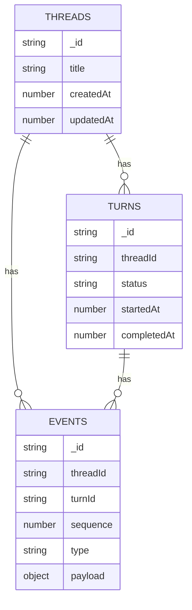

# Codex Data Model (Events, Items, UI Cells)

This document describes the concrete data structures that power the Codex CLI
conversation UI and how those structures map to storage and client rendering.
It is intended to guide implementation of similar systems in other stacks.

## 1) Core Protocol: Event Envelope + EventMsg
Codex core emits an ordered stream of `Event` values. Each event wraps a payload
(`EventMsg`) plus a submission-correlated `id`.

- Event envelope:
  `src/coding-agents/codex/codex-rs/protocol/src/protocol.rs:616`

### EventMsg (key variants)
The event payloads are modeled in `EventMsg` (snake_case on the wire).

- `EventMsg` enum:
  `src/coding-agents/codex/codex-rs/protocol/src/protocol.rs:629`

Important payload types:

- Turn lifecycle:
  - `TurnStartedEvent` `src/coding-agents/codex/codex-rs/protocol/src/protocol.rs:970`
  - `TurnCompleteEvent` `src/coding-agents/codex/codex-rs/protocol/src/protocol.rs:965`
- Agent + user messaging:
  - `AgentMessageEvent` `src/coding-agents/codex/codex-rs/protocol/src/protocol.rs:1186`
  - `AgentMessageDeltaEvent` `src/coding-agents/codex/codex-rs/protocol/src/protocol.rs:1198`
  - `UserMessageEvent` `src/coding-agents/codex/codex-rs/protocol/src/protocol.rs:1191`
- Reasoning:
  - `AgentReasoningEvent` `src/coding-agents/codex/codex-rs/protocol/src/protocol.rs:1203`
  - `AgentReasoningDeltaEvent` `src/coding-agents/codex/codex-rs/protocol/src/protocol.rs:1227`
  - `AgentReasoningRawContentEvent` `src/coding-agents/codex/codex-rs/protocol/src/protocol.rs:1208`
  - `AgentReasoningRawContentDeltaEvent` `src/coding-agents/codex/codex-rs/protocol/src/protocol.rs:1213`
  - `AgentReasoningSectionBreakEvent` `src/coding-agents/codex/codex-rs/protocol/src/protocol.rs:1217`
- Exec and tool output:
  - `ExecCommandBeginEvent` `src/coding-agents/codex/codex-rs/protocol/src/protocol.rs:1599`
  - `ExecCommandOutputDeltaEvent` `src/coding-agents/codex/codex-rs/protocol/src/protocol.rs:1676`
  - `TerminalInteractionEvent` `src/coding-agents/codex/codex-rs/protocol/src/protocol.rs:1692`
  - `ExecCommandEndEvent` `src/coding-agents/codex/codex-rs/protocol/src/protocol.rs:1623`
- Plan updates:
  - `EventMsg::PlanUpdate(UpdatePlanArgs)` `src/coding-agents/codex/codex-rs/protocol/src/protocol.rs:755`

### Exec-specific types (core protocol)
Exec events carry normalized command metadata and output:

- `ExecCommandSource` enum `src/coding-agents/codex/codex-rs/protocol/src/protocol.rs:1583`
- `ParsedCommand` variants (`Read`, `ListFiles`, `Search`, `Unknown`):
  `src/coding-agents/codex/codex-rs/protocol/src/parse_command.rs:6`
- `ExecCommandBeginEvent` fields:
  - `call_id`, `process_id`, `turn_id`, `command`, `cwd`, `parsed_cmd`, `source`
  `src/coding-agents/codex/codex-rs/protocol/src/protocol.rs:1599`
- `ExecCommandEndEvent` fields:
  - `stdout`, `stderr`, `aggregated_output`, `exit_code`, `duration`, `formatted_output`
  `src/coding-agents/codex/codex-rs/protocol/src/protocol.rs:1623`

### Plan update types
Plan updates are modeled as structured steps with status:

- `UpdatePlanArgs`, `PlanItemArg`, `StepStatus`:
  `src/coding-agents/codex/codex-rs/protocol/src/plan_tool.rs:6`

## 2) Exec JSONL Processor: Thread Items
The exec event processor converts core events into `ThreadItem` records used
by JSONL output and app-server protocol.

- Conversion of `PlanUpdate` -> `TodoListItem`:
  `src/coding-agents/codex/codex-rs/exec/src/event_processor_with_jsonl_output.rs:438`
- `TodoItem`/`TodoListItem` data types:
  `src/coding-agents/codex/codex-rs/exec/src/exec_events.rs:233`

## 3) App-Server Protocol (v2) Data Model
The app-server protocol defines a structured model for non-TUI clients.

### Turn and ThreadItem
- `Turn` (id, status, items, error):
  `src/coding-agents/codex/codex-rs/app-server-protocol/src/protocol/v2.rs:1403`
- `TurnStatus`:
  `src/coding-agents/codex/codex-rs/app-server-protocol/src/protocol/v2.rs:1440`
- `ThreadItem` union (CommandExecution, AgentMessage, UserMessage, etc.):
  `src/coding-agents/codex/codex-rs/app-server-protocol/src/protocol/v2.rs:1577`

Reasoning items in v2:

- `ThreadItem::Reasoning` includes `summary` and `content` arrays for reasoning
  text (summary) and raw content (full transcript).
  `src/coding-agents/codex/codex-rs/app-server-protocol/src/protocol/v2.rs:1590`

### Parsed commands for UI summaries
The app-server protocol re-exports parsed command semantics as `CommandAction`:

- `CommandAction` and mapping to core types:
  `src/coding-agents/codex/codex-rs/app-server-protocol/src/protocol/v2.rs:653`

This is used by `ThreadItem::CommandExecution.command_actions` for tool-call
summaries (read/list/search grouping).

### Plan updates (v2)
Plan updates are expressed as a notification payload:

- `TurnPlanUpdatedNotification`:
  `src/coding-agents/codex/codex-rs/app-server-protocol/src/protocol/v2.rs:1793`

## 4) TUI Local Data Model
The TUI renders events via history cells and a streaming controller.

### HistoryCell (renderable unit)
- Trait definition:
  `src/coding-agents/codex/codex-rs/tui/src/history_cell.rs:77`

Key cell types:

- `UserHistoryCell` (user prompt) `history_cell.rs:163`
- `AgentMessageCell` (streamed agent text) `history_cell.rs:261`
- `ReasoningSummaryCell` `history_cell.rs:190`
- `PlanUpdateCell` (plan/todo list) `history_cell.rs:1506`
- `ExecCell` (tool calls) `exec_cell/model.rs:28`
- `McpToolCallCell` (tool call rows) `history_cell.rs:1041`

### ExecCell / ExecCall / CommandOutput
- `ExecCall` includes `call_id`, `command`, `parsed`, `source`, `output`,
  `start_time`, `duration`:
  `src/coding-agents/codex/codex-rs/tui/src/exec_cell/model.rs:20`
- `CommandOutput` aggregates stdout/stderr and formatted output:
  `src/coding-agents/codex/codex-rs/tui/src/exec_cell/model.rs:9`

### Streaming controller
- `StreamController` manages newline-gated streaming and commit animation:
  `src/coding-agents/codex/codex-rs/tui/src/streaming/controller.rs:7`
- `MarkdownStreamCollector` renders markdown and commits only full lines:
  `src/coding-agents/codex/codex-rs/tui/src/markdown_stream.rs:7`

### Status indicator (shimmer + elapsed)
- `StatusIndicatorWidget` fields:
  `src/coding-agents/codex/codex-rs/tui/src/status_indicator_widget.rs:33`
- Render logic (shimmer, elapsed time, interrupt hint):
  `src/coding-agents/codex/codex-rs/tui/src/status_indicator_widget.rs:198`

## 5) Persistence Model (Resume/Replay)
Codex persists a subset of events to reconstruct history.

- Persistence policy: `should_persist_event_msg`
  `src/coding-agents/codex/codex-rs/core/src/rollout/policy.rs:36`
- Rebuild turns from persisted events:
  `src/coding-agents/codex/codex-rs/app-server-protocol/src/protocol/thread_history.rs:13`

## 6) Suggested Convex Data Model (translation-ready)
A minimal Convex schema that mirrors Codex’s event-centric model:

### `threads`
- `_id`, `title`, `createdAt`, `updatedAt`

### `turns`
- `_id`, `threadId`, `status`, `startedAt`, `completedAt`

### `events`
- `_id`, `threadId`, `turnId`, `sequence`, `type`, `payload`

Recommended `type` values:

- `user_message`
- `agent_message_delta`
- `agent_message`
- `reasoning_delta`
- `reasoning_section_break`
- `reasoning_raw_content`
- `turn_started`, `turn_completed`, `turn_aborted`
- `plan_update`
- `exec_begin`, `exec_output_delta`, `exec_end`

This mirrors the Codex `EventMsg` stream and allows the UI to reconstruct
status header, streaming text, and plan/tool call UI.

## 7) ER Diagram (Convex translation)
Use this as a starting point for your Convex schema. It reflects the minimal
tables described above and their relationships.



## 8) JSON Schema Example (Event Payloads)
Below is a compact JSON Schema-like guide for the `events` payloads you’ll
want in Convex. You can store these as free-form JSON, or validate them with
Convex validators if you prefer stricter typing.

```json
{
  "type": "object",
  "properties": {
    "type": {
      "type": "string",
      "enum": [
        "user_message",
        "agent_message_delta",
        "agent_message",
        "reasoning_delta",
        "reasoning_section_break",
        "reasoning_raw_content",
        "turn_started",
        "turn_completed",
        "turn_aborted",
        "plan_update",
        "exec_begin",
        "exec_output_delta",
        "exec_end"
      ]
    },
    "payload": {
      "type": "object",
      "oneOf": [
        {
          "title": "user_message",
          "properties": {
            "text": { "type": "string" },
            "images": { "type": "array", "items": { "type": "string" } }
          },
          "required": ["text"]
        },
        {
          "title": "agent_message_delta",
          "properties": {
            "delta": { "type": "string" }
          },
          "required": ["delta"]
        },
        {
          "title": "agent_message",
          "properties": {
            "text": { "type": "string" }
          },
          "required": ["text"]
        },
        {
          "title": "reasoning_delta",
          "properties": {
            "delta": { "type": "string" }
          },
          "required": ["delta"]
        },
        {
          "title": "reasoning_section_break",
          "properties": {
            "itemId": { "type": "string" },
            "summaryIndex": { "type": "number" }
          }
        },
        {
          "title": "reasoning_raw_content",
          "properties": {
            "text": { "type": "string" }
          },
          "required": ["text"]
        },
        {
          "title": "turn_started",
          "properties": {
            "modelContextWindow": { "type": "number" }
          }
        },
        {
          "title": "turn_completed",
          "properties": {
            "lastAgentMessage": { "type": "string" }
          }
        },
        {
          "title": "turn_aborted",
          "properties": {
            "reason": { "type": "string", "enum": ["interrupted", "failed", "replaced"] }
          },
          "required": ["reason"]
        },
        {
          "title": "plan_update",
          "properties": {
            "explanation": { "type": "string" },
            "steps": {
              "type": "array",
              "items": {
                "type": "object",
                "properties": {
                  "step": { "type": "string" },
                  "status": { "type": "string", "enum": ["pending", "in_progress", "completed"] }
                },
                "required": ["step", "status"]
              }
            }
          },
          "required": ["steps"]
        },
        {
          "title": "exec_begin",
          "properties": {
            "callId": { "type": "string" },
            "command": { "type": "array", "items": { "type": "string" } },
            "cwd": { "type": "string" },
            "commandActions": {
              "type": "array",
              "items": {
                "type": "object",
                "properties": {
                  "type": { "type": "string", "enum": ["read", "list_files", "search", "unknown"] },
                  "command": { "type": "string" },
                  "path": { "type": "string" },
                  "query": { "type": "string" },
                  "name": { "type": "string" }
                },
                "required": ["type", "command"]
              }
            }
          },
          "required": ["callId", "command"]
        },
        {
          "title": "exec_output_delta",
          "properties": {
            "callId": { "type": "string" },
            "stream": { "type": "string", "enum": ["stdout", "stderr"] },
            "chunk": { "type": "string" }
          },
          "required": ["callId", "chunk"]
        },
        {
          "title": "exec_end",
          "properties": {
            "callId": { "type": "string" },
            "exitCode": { "type": "number" },
            "aggregatedOutput": { "type": "string" },
            "durationMs": { "type": "number" }
          },
          "required": ["callId", "exitCode"]
        }
      ]
    }
  },
  "required": ["type", "payload"]
}
```

### Notes on schema usage
- You can store `payload` as free-form JSON in Convex and still use this schema
  as a guide for reducers and UI rendering.
- If you prefer strict validation, map each event type to a Convex validator
  and enforce it at write time.
