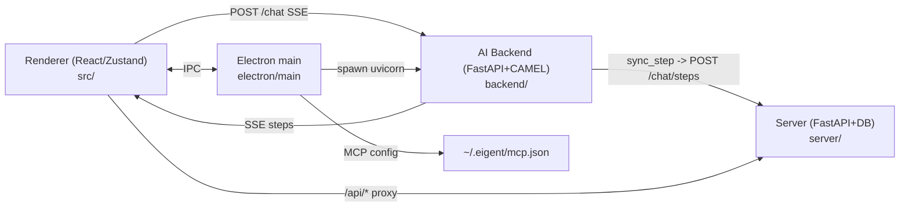
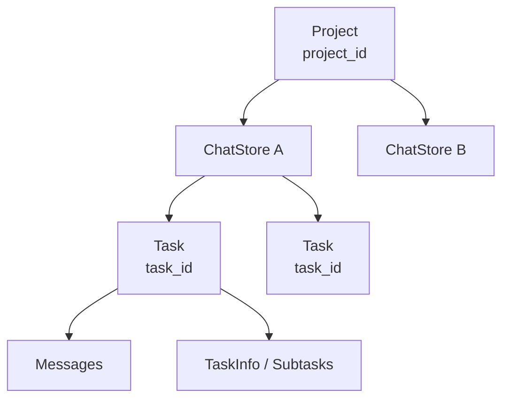
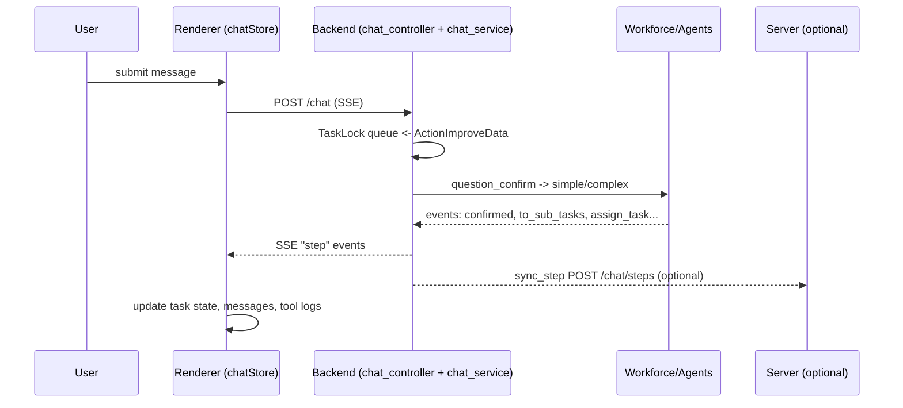
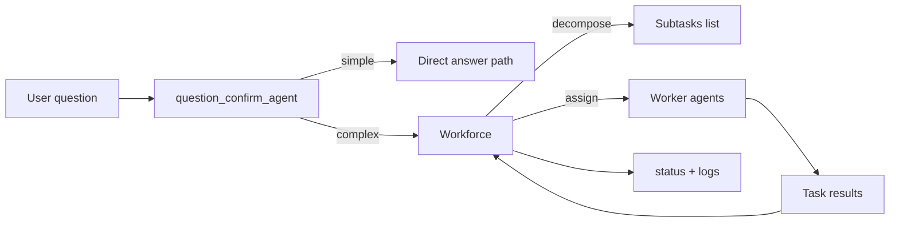
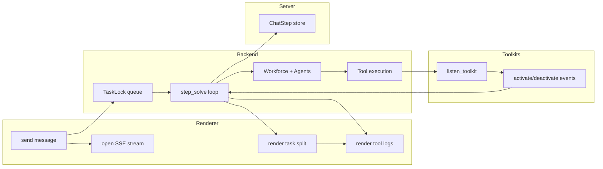

# Eigent Architecture - Onboarding Doc

## Eigent deep-dive (what they actually do)

- Agentic orchestration: pre-triage with a "question_confirm" agent -> simple answers bypass workforce; complex tasks
  spin up Workforce with coordinator + task planner + worker nodes, then decompose + assign subtasks, stream
  decomposition, and run tasks in parallel. Code: backend/app/service/chat_service.py, backend/app/utils/workforce.py,
  backend/app/utils/single_agent_worker.py.
- Fluid handoff + tracking: assigns each agent a stable agent_id, maps CAMEL node_id -> agent_id for UI, emits
  create_agent/activate_agent/deactivate_agent/assign_task events, and uses process_task_id to tag tool calls by
  subtask. Code: backend/app/utils/workforce.py, backend/app/utils/agent.py, backend/app/service/task.py, backend/app/utils/listen/toolkit_listen.py.
- Tool mapping: fixed toolkit bundles per built-in agent + dynamic tool lists for custom workers; MCP tools loaded on
  demand and merged into tools list; tool events are emitted for UI/logging with truncated args/results. Code:
  backend/app/utils/agent.py, backend/app/utils/toolkit/*, backend/app/utils/listen/toolkit_listen.py.
- Model ids + routing: UI selects model_platform + model_type + api_url/key; backend uses CAMEL ModelFactory per
  request, with extra params and stream config for planner. Code: backend/app/utils/agent.py, src/store/chatStore.ts,
  backend/app/model/chat.py.
- Context management: in-memory TaskLock.conversation_history per project, append task results + generated files;
  reuse that to build coordinator context only; char-limit guard (100k) emits context_too_long; summaries generated
  for tasks/subtasks; multi-turn preserves history and last result. Code: backend/app/service/task.py, backend/app/service/chat_service.py.
- User/session/thread/message handling: "project_id" is the long-lived thread; "task_id" is the run. TaskLock keyed by
  project; SSE stream drives UI. Persisted records: ChatHistory (per run), ChatStep (event log for playback),
  ChatSnapshot (browser screenshots). Code: backend/app/controller/chat_controller.py, backend/app/utils/server/sync_step.py, server/app/model/chat/*, server/app/controller/chat/*, src/store/chatStore.ts.
- Session/tool state: per-user env path via thread-local env loader; browser toolkit uses session IDs + pooling; MCP
  auth dir is shared to avoid re-auth. Code: backend/app/component/environment.py, backend/app/utils/toolkit/hybrid_browser_toolkit.py, backend/app/utils/agent.py.

## TL;DR

Eigent is a desktop shell that runs a local FastAPI AI runtime. The runtime triages each request, either answering
directly or spinning up a multi-agent workforce, and streams all step events to the UI. Tool calls and agent
lifecycles are fully instrumented so the UI can render live status, while a separate server persists history and
event logs for replay/sharing.

Scope: desktop app + local AI runtime + optional cloud/local persistence. Focus on sessions, threads, tool calls, model selection, context window.

## System Map

- Renderer: Vite + React + Zustand. UI, state, SSE client. Core: `src/`.
- Electron main: app shell, backend process, MCP config, webviews. Core: `electron/`.
- Backend (AI runtime): FastAPI + CAMEL workforce, SSE stream, tools. Core: `backend/`.
- Server (persistence/identity): FastAPI + SQLModel for history, steps, snapshots, share. Core: `server/`.
- Docs: concept model. Core: `docs/core/`.

## Sessions, Threads, Tasks: Mental Model

- Session = project. Frontend: project store. Backend: TaskLock keyed by `project_id`. Server: ChatHistory grouped by `project_id`.
- Thread = chat store per project (multiple allowed). Each chat store = one UI timeline of tasks. Frontend only.
- Task = unit of work per user question. `task_id` changes per round, tied to `project_id`.
- Messages = per task. UI stores message list; backend streams steps; server stores steps for replay/share.

Key files:
- `src/store/projectStore.ts` — project/session; multiple chat stores.
- `src/store/chatStore.ts` — tasks + messages per chat store.
- `backend/app/service/task.py` — TaskLock, queue, conversation history.
- `server/app/model/chat/chat_history.py` — project/task persistence.

## Project -> ChatStore -> Task -> Messages

## End-to-End Message Flow (SSE)

1) User sends message.
2) UI selects model/provider + workers.
3) UI POSTs `/chat` to backend; opens SSE stream.
4) Backend enqueues ActionImproveData; `step_solve` emits events.
5) UI maps events to task + agents + logs.

## SSE Event Protocol

- Event format: `{"step": "...", "data": {...}}` in `backend/app/model/chat.py`.
- Action enum defines canonical steps: `backend/app/service/task.py`.
- Frontend mapping: `src/store/chatStore.ts` handles each step.

Common steps (UI-visible):
- `confirmed` — task accepted, used to create new chat store in multi-turn.
- `decompose_text` — streaming decomposition text for "task split" UI.
- `to_sub_tasks` — structured subtask tree + summary.
- `assign_task`, `activate_agent`, `deactivate_agent` — workforce live status.
- `activate_toolkit`, `deactivate_toolkit` — tool call start/finish.
- `terminal`, `write_file` — terminal output, file artifacts.
- `ask` — human-in-loop question.
- `wait_confirm` — direct answer for simple queries.
- `end`, `error`, `context_too_long`, `budget_not_enough`.

## Workforce Orchestration

- Core class: `backend/app/utils/workforce.py` extends CAMEL Workforce.
- Subtask decomposition is explicit: `eigent_make_sub_tasks` then `eigent_start`.
- Worker execution: `backend/app/utils/single_agent_worker.py` adds streaming + memory transfer.

## Swimlane: Task Execution + Tool Call Mapping

## Tool Call Mapping (What, Where, Why)

- Instrumentation point 1: `backend/app/utils/agent.py` overrides `_execute_tool` / `_aexecute_tool`.
  - Emits `activate_toolkit` + `deactivate_toolkit` with args/results.
  - Preserves ContextVar `process_task_id` via `set_process_task` in `backend/app/service/task.py`.
- Instrumentation point 2: `backend/app/utils/listen/toolkit_listen.py`
  - Decorator `listen_toolkit` wraps toolkit methods.
  - Sends same events; resolves `process_task_id` via ContextVar fallback.
- UI mapping: `src/store/chatStore.ts`
  - `resolveProcessTaskIdForToolkitEvent` assigns tool events to correct subtask.
  - Updates agent logs and task status.

## Model Selection + System Prompting

- Frontend model routing: `src/store/chatStore.ts`
  - Reads `modelType` from auth store.
  - `custom/local`: `GET /api/providers?prefer=true` for provider config.
  - `cloud`: `GET /api/user/key` for cloud key + `cloud_model_type`.
  - Sends `model_platform`, `model_type`, `api_url`, `extra_params` in `/chat` body.
- Backend model instantiation: `backend/app/utils/agent.py` `agent_model()`
  - `ModelFactory.create(model_platform, model_type, api_key, url, extra_params)`.
- System prompts live in `backend/app/utils/agent.py`
  - `developer_agent`, `search_agent`, `document_agent`, `multi_modal_agent`.
  - `question_confirm_agent` decides simple vs complex.
  - `task_summary_agent` generates short task summary for UI.

## Context Window + Compaction

- Context store: `TaskLock.conversation_history` in `backend/app/service/task.py`.
- Context build: `build_conversation_context` in `backend/app/service/chat_service.py`.
  - Includes previous task content/results and generated file list.
- Hard limit: `check_conversation_history_length` in `backend/app/service/chat_service.py` (100,000 chars).
  - Emits `context_too_long` SSE.
  - UI blocks input: `src/store/chatStore.ts` sets `isContextExceeded`; `src/components/ChatBox/index.tsx` disables input.
- Compaction: no automatic shrink. Only summary for UI, not rolling compression.
  - `summary_task` in `backend/app/service/chat_service.py` used for UI task summary.
  - `prune_tool_calls_from_memory=True` used for some agents in `backend/app/utils/agent.py`.
  - Workflow memory optional: `enable_workflow_memory` in `backend/app/utils/single_agent_worker.py`.

## Replay + Share

- SSE step storage: `server/app/controller/chat/step_controller.py` + `server/app/model/chat/chat_step.py`.
- Sync bridge: `backend/app/utils/server/sync_step.py` sends steps to server when `SERVER_URL` set.
- Replay: `GET /chat/steps/playback/{task_id}`; used by UI `chatStore.replay`.
- Share: tokens + playback in `server/app/controller/chat/share_controller.py`.
- Snapshots: `server/app/controller/chat/snapshot_controller.py` stores browser screenshots for search agent.

## How to Build a New Tool (Canonical Path)

1) Implement toolkit class in `backend/app/utils/toolkit/`.
2) Decorate tool methods with `listen_toolkit` for workflow logging.
3) Register in `get_toolkits()` map in `backend/app/utils/agent.py`.
4) Expose in UI tool picker if needed: `src/components/AddWorker/ToolSelect.tsx`.
5) For MCP tools: define config in `electron/main/utils/mcpConfig.ts` or via UI, stored in `~/.eigent/mcp.json`.
6) For server-side persistence or sharing, ensure step sync is enabled via `SERVER_URL`.

## Key Files to Read First

- `src/store/chatStore.ts` — SSE handling, message routing, tool log mapping.
- `src/store/projectStore.ts` — session/project + chat stores.
- `src/api/http.ts` — local backend vs proxy server routing.
- `backend/app/controller/chat_controller.py` — `/chat` SSE endpoints + lifecycle.
- `backend/app/service/chat_service.py` — step loop, question_confirm, context handling.
- `backend/app/service/task.py` — Action enum, TaskLock, queue, ContextVar.
- `backend/app/utils/agent.py` — model selection, system prompts, tool plumbing.
- `backend/app/utils/workforce.py` — decomposition + workforce runtime.
- `backend/app/utils/listen/toolkit_listen.py` — tool event instrumentation.
- `backend/app/utils/server/sync_step.py` — step sync to server.
- `server/app/controller/chat/*.py` — history, steps, snapshots, share.
- `electron/main/init.ts` — spawn backend, ports, env wiring.
- `electron/main/utils/mcpConfig.ts` — MCP config file layout.
- `docs/core/*.md` — concept language for onboarding.

## Quick "What Lives Where"

- UI/State: `src/`
- Electron shell/IPC: `electron/`
- AI runtime + tools: `backend/`
- Persistence + sharing: `server/`
- Concept docs: `docs/`
