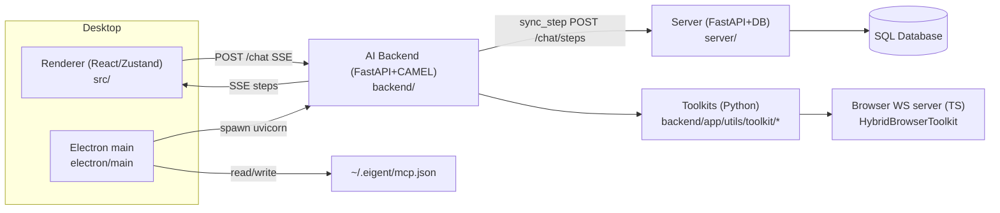
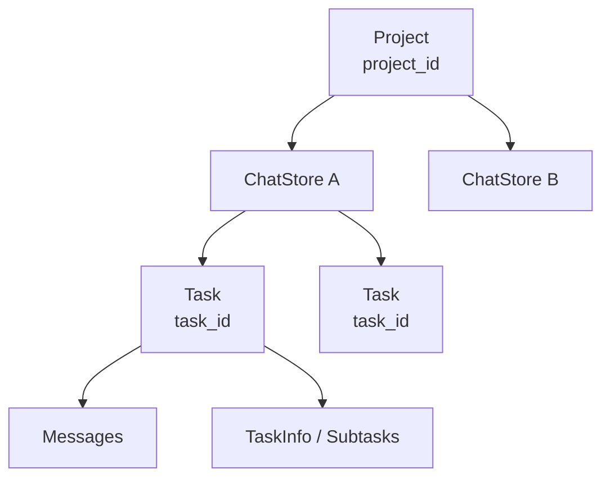
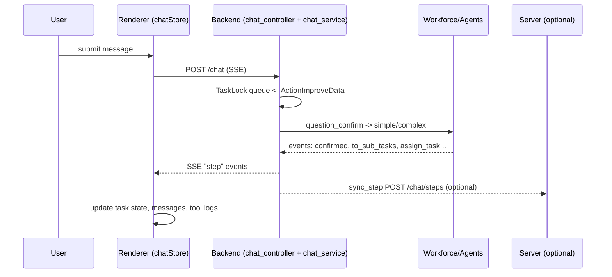
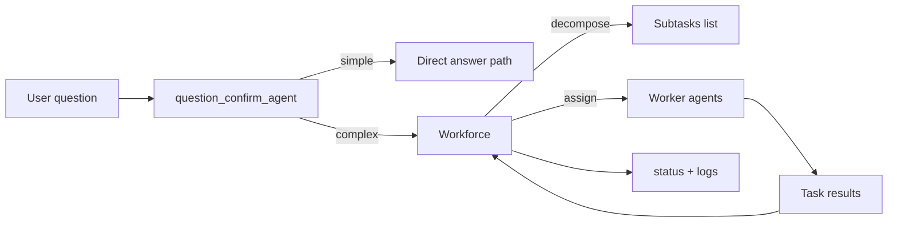
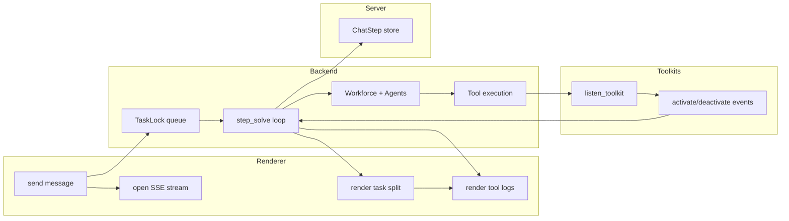
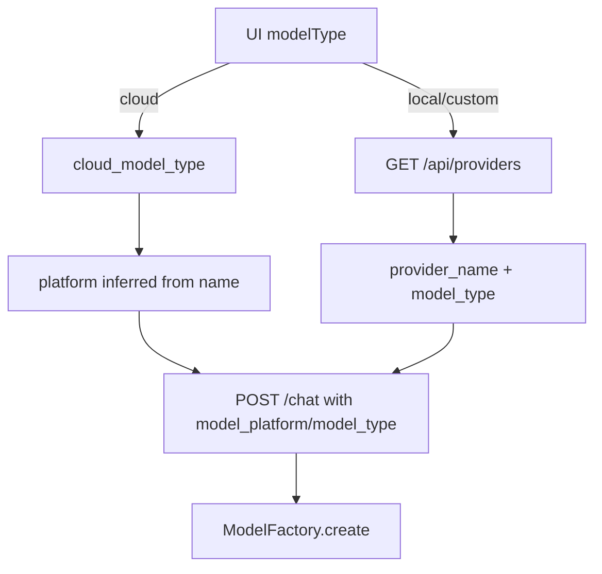
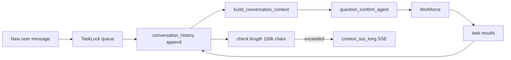
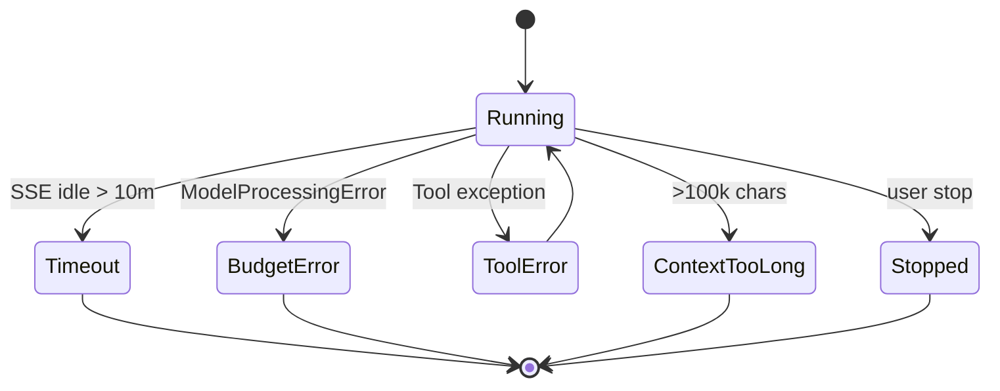

# Eigent Architecture - Onboarding Doc

> **Purpose:** This document explains how Eigent is scaffolded end‑to‑end (UI → backend → tools → persistence). It is meant to onboard engineers building agentic systems with sessions, tool orchestration, model selection, and context handling.

---

## TL;DR

Eigent is a desktop app (Electron + React) that launches a local FastAPI AI runtime (CAMEL‑based) and optionally syncs events to a server for persistence/replay/sharing. Each user request becomes a task within a long‑lived project session. The backend streams step events via SSE to the UI, which renders tasks, agents, and tool logs. Tool calls are instrumented for visibility and tied back to subtasks with `process_task_id`.

---

## System Map

- **Renderer**: Vite + React + Zustand. UI, state, SSE client. Core: `src/`
- **Electron main**: Desktop shell, spawns backend, manages ports, MCP config. Core: `electron/`
- **Backend (AI runtime)**: FastAPI + CAMEL workforce, SSE stream, tools. Core: `backend/`
- **Server (optional)**: FastAPI + SQLModel for history, steps, snapshots, share. Core: `server/`
- **Docs**: Concept model. Core: `docs/core/`

---

## Runtime Boot + Environment

Electron launches the backend process, selects a port, and wires environment variables used by toolkits and models.

**Flow**
1. Electron finds/creates a port (kills stale processes if needed).
2. Electron spawns FastAPI (`uv run uvicorn main:api`).
3. Electron sets env vars: `SERVER_URL`, npm cache, venv, etc.
4. Backend loads global `~/.eigent/.env` and per‑user `.env` (thread‑local).

**Key files**
- `electron/main/init.ts`
- `backend/app/component/environment.py`
- `backend/app/controller/chat_controller.py`

---

## Sessions, Threads, Tasks (Mental Model)

- **Session = project**: long‑lived thread ID (`project_id`).
- **Thread**: UI chat store for a project (frontend only).
- **Task**: one run of a user request (`task_id`).
- **Message**: UI message list per task.

**Where it lives**
- `src/store/projectStore.ts`
- `src/store/chatStore.ts`
- `backend/app/service/task.py`
- `server/app/model/chat/chat_history.py`

---

## End‑to‑End Message Flow (SSE)

---

## SSE Event Protocol

- Event format: `{"step": "...", "data": {...}}` in `backend/app/model/chat.py`.
- Action enum defines canonical steps: `backend/app/service/task.py`.
- Frontend mapping: `src/store/chatStore.ts`.

Common steps:
- `confirmed` — task accepted
- `decompose_text` — streaming decomposition text
- `to_sub_tasks` — structured subtask tree + summary
- `assign_task`, `activate_agent`, `deactivate_agent`
- `activate_toolkit`, `deactivate_toolkit`
- `terminal`, `write_file`
- `ask` — human‑in‑loop question
- `wait_confirm` — direct answer for simple queries
- `end`, `error`, `context_too_long`, `budget_not_enough`

---

## Workforce Orchestration

Eigent wraps CAMEL Workforce with:
- Streaming decomposition text and structured subtask tree
- Agent lifecycle events and task assignment events
- Failure handling strategies (`retry`, `replan`)

**Key files**
- `backend/app/utils/workforce.py`
- `backend/app/utils/single_agent_worker.py`
- `backend/app/utils/agent.py`

---

## Swimlane: Task Execution + Tool Call Mapping

---

## Tool Call Mapping (What, Where, Why)

Two instrumentation layers ensure tool calls are visible in UI:

1) **Agent‑level**: `ListenChatAgent._execute_tool` and `_aexecute_tool` emit `activate_toolkit` / `deactivate_toolkit` with args and results. (`backend/app/utils/agent.py`)

2) **Toolkit‑level**: `@listen_toolkit` decorator wraps toolkit methods, also emitting events and binding to `process_task_id` via ContextVar. (`backend/app/utils/listen/toolkit_listen.py`)

UI resolves tool events to the correct subtask:
- `resolveProcessTaskIdForToolkitEvent` in `src/store/chatStore.ts`.

---

## How to Build a New Tool (Canonical Path)

1) Implement toolkit class in `backend/app/utils/toolkit/`.
2) Decorate tool methods with `listen_toolkit` or use `auto_listen_toolkit`.
3) Register in `get_toolkits()` map in `backend/app/utils/agent.py`.
4) Expose in UI tool picker if needed: `src/components/AddWorker/ToolSelect.tsx`.
5) For MCP tools: config is stored in `~/.eigent/mcp.json` (see `electron/main/utils/mcpConfig.ts`).

---

## Model Selection + System Prompting

- UI picks **modelType** (`cloud` | `local` | `custom`) in `src/store/authStore.ts`.
- For cloud, UI infers platform from model name (`gpt`, `claude`, `gemini`).
- Backend constructs models with `ModelFactory.create(...)` in `backend/app/utils/agent.py`.
- System prompts for each agent live in `backend/app/utils/agent.py`.

---

## Context Window + Compaction

- Context is stored per project in memory: `TaskLock.conversation_history`.
- Context building includes previous task content, results, and generated files.
- Hard limit is **100,000 chars**. Exceeding triggers `context_too_long` SSE and UI disables input.
- **No automatic compaction**. Only task summaries are generated for UI and multi‑subtask results.

**Key files**
- `backend/app/service/chat_service.py`
- `backend/app/service/task.py`
- `backend/app/model/chat.py`
- `src/components/ChatBox/index.tsx`

---

## Memory (Workflow vs Conversation)

- **Conversation history** lives in `TaskLock.conversation_history` (in‑memory only).
- **Workflow memory** exists in CAMEL agent memory and can be transferred from worker → accumulator if `enable_workflow_memory` is true. Default is false.
- `share_memory` exists in Workforce but defaults false.

Key files:
- `backend/app/utils/single_agent_worker.py`
- `backend/app/utils/workforce.py`
- `backend/app/utils/agent.py`

---

## Failure Modes + Recovery

- **SSE timeout**: 10 minutes idle closes stream silently (`backend/app/controller/chat_controller.py`).
- **Budget exceeded**: emits `budget_not_enough` (`backend/app/utils/agent.py`).
- **Invalid/empty task**: fails during decomposition (`backend/app/utils/workforce.py`).
- **Tool failure**: caught and returned as tool error (`backend/app/utils/agent.py`).
- **Context too long**: emits `context_too_long`, UI disables input (`backend/app/service/chat_service.py`).

---

## Persistence + Replay + Share (Server)

Server stores chat metadata and step events. Replay and share are SSE‑driven.

- **ChatHistory**: task metadata (`server/app/model/chat/chat_history.py`).
- **ChatStep**: event log for playback (`server/app/model/chat/chat_step.py`).
- **ChatSnapshot**: browser screenshot storage (`server/app/model/chat/chat_snpshot.py`).
- **Share tokens**: generated + verified in `server/app/model/chat/chat_share.py`.

---

## MCP Configuration + Auth

- MCP config file: `~/.eigent/mcp.json`.
- Supports `command + args` or `url`.
- Args are normalized to arrays (strings are parsed or split).
- Tool install/uninstall endpoints live in `backend/app/controller/tool_controller.py`.
- OAuth flow is tracked by `backend/app/utils/oauth_state_manager.py`.

---

## Key Files to Read First

- `eigent-architecture.md`
- `backend/app/controller/chat_controller.py`
- `backend/app/service/chat_service.py`
- `backend/app/service/task.py`
- `backend/app/utils/agent.py`
- `backend/app/utils/workforce.py`
- `backend/app/utils/listen/toolkit_listen.py`
- `backend/app/utils/toolkit/hybrid_browser_toolkit.py`
- `backend/app/utils/toolkit/terminal_toolkit.py`
- `src/store/chatStore.ts`
- `src/store/projectStore.ts`
- `src/api/http.ts`
- `electron/main/init.ts`
- `electron/main/utils/mcpConfig.ts`
- `server/app/controller/chat/step_controller.py`

---

## Current TODOs to Keep in Mind

These are in code and affect how the system is expected to evolve:

- `src/store/chatStore.ts` — historyId migration TODOs.
- `src/store/chatStore.ts` — attaches don’t reach backend when Improve API is called.
- `src/store/projectStore.ts` — historyId removal TODO.
- `src/components/ChatBox/BottomBox/index.tsx` — queued box feature disabled.
- `src/components/SearchHistoryDialog.tsx` — delete/share TODOs.
- `electron/main/index.ts` — TODO for dynamic provider selection.
- `src/store/chatStore.ts` — endpoint rename TODO (project_id).

---

## Appendix: Quick “What Lives Where”

- UI/state: `src/`
- Electron shell/IPC: `electron/`
- AI runtime + tools: `backend/`
- Persistence + sharing: `server/`
- Concept docs: `docs/`
