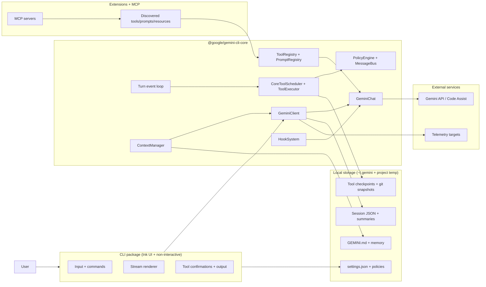
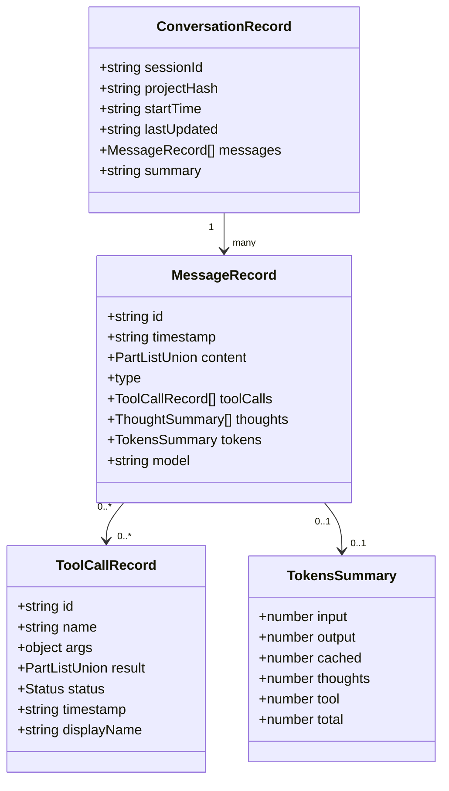
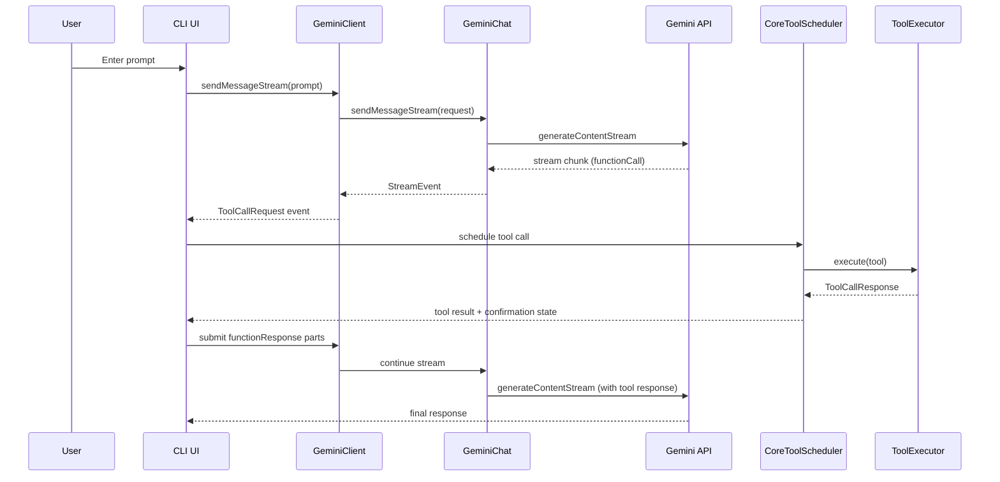
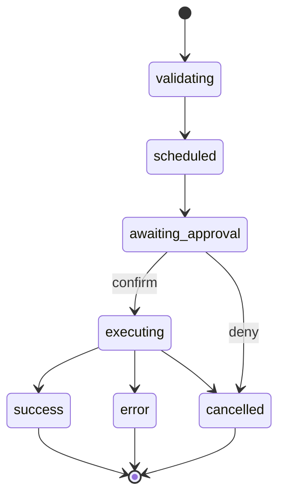
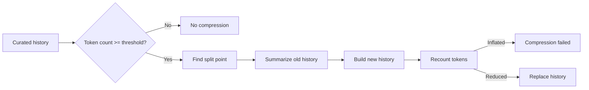
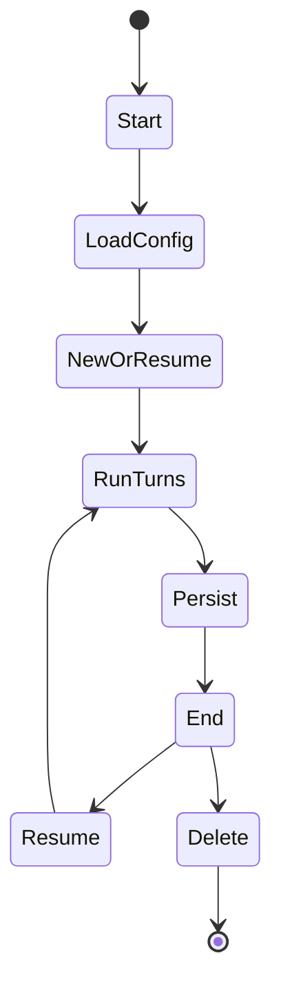
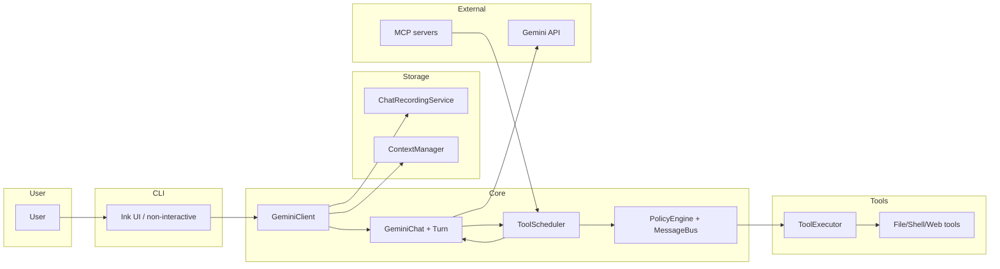

# Gemini CLI Architecture - Onboarding Doc

## TL;DR
Gemini CLI is a local-first terminal agent made of a CLI UI package and a Core runtime. The CLI gathers input, renders streaming output, and schedules tool confirmations while Core builds prompts, routes models, executes tools, and persists sessions. Tool execution is governed by a policy engine and message bus, and extensions/MCP servers can add tools, prompts, and resources.

## System Map



## Execution Environment
- Gemini CLI runs as a local Node.js process and executes tools on the host by default.
- Optional sandboxing is supported via `--sandbox` or `GEMINI_SANDBOX` with macOS Seatbelt (`sandbox-exec`) or container runtimes (Docker/Podman). Sandbox selection and image resolution live in `gemini-cli/packages/cli/src/config/sandboxConfig.ts`, and sandbox startup logic lives in `gemini-cli/packages/cli/src/utils/sandbox.ts`.
- Shell execution is managed by `gemini-cli/packages/core/src/services/shellExecutionService.ts`, which supports PTY-backed execution and output handling.
- Tool confirmations and policy decisions are handled locally through the message bus in `gemini-cli/packages/core/src/confirmation-bus/message-bus.ts` and the policy engine in `gemini-cli/packages/core/src/policy/policy-engine.ts`.

## Core Data Model
Gemini CLI persists a structured conversation record per session. The key types are defined in `gemini-cli/packages/core/src/services/chatRecordingService.ts`.



Related runtime types for tool execution are defined in `gemini-cli/packages/core/src/scheduler/types.ts` (`ToolCallRequestInfo`, `ToolCallResponseInfo`, and tool call status variants).

## Message Lifecycle
1. **CLI input**: Interactive mode is initialized in `gemini-cli/packages/cli/src/gemini.tsx`. Non-interactive mode is handled in `gemini-cli/packages/cli/src/nonInteractiveCli.ts`.
2. **Config + services**: `Config` wires registries, policy engine, hooks, and the Gemini client in `gemini-cli/packages/core/src/config/config.ts`.
3. **Prompt submission**: UI hooks like `useGeminiStream` (`gemini-cli/packages/cli/src/ui/hooks/useGeminiStream.ts`) call `GeminiClient.sendMessageStream`.
4. **Turn orchestration**: `GeminiClient` (`gemini-cli/packages/core/src/core/client.ts`) checks token budget, applies compression, chooses a model, then runs a `Turn`.
5. **Model streaming**: `GeminiChat.sendMessageStream` (`gemini-cli/packages/core/src/core/geminiChat.ts`) streams responses from Gemini API and handles retries.
6. **Tool call extraction**: `Turn.run` (`gemini-cli/packages/core/src/core/turn.ts`) converts function calls into `ToolCallRequestInfo` events.
7. **Tool scheduling**: `CoreToolScheduler` (`gemini-cli/packages/core/src/core/coreToolScheduler.ts`) validates, confirms, and executes tool calls through `ToolExecutor`.
8. **Tool responses**: tool outputs are converted to function responses and appended to chat history, then Gemini API is called again to continue the turn.
9. **Persistence + telemetry**: `ChatRecordingService` writes session JSON; telemetry events are emitted via `gemini-cli/packages/core/src/telemetry/*`.

## Sequence: User → Tool → Response



## Tool System

### Tool Call Mapping
Tool call lifecycle is modeled in `gemini-cli/packages/core/src/scheduler/types.ts` and driven by `CoreToolScheduler`.



Key components:
- **Tool definitions**: `gemini-cli/packages/core/src/tools/tools.ts` (base classes and schemas).
- **Registry**: `gemini-cli/packages/core/src/tools/tool-registry.ts` (registration, discovery, and filtering).
- **Scheduler**: `gemini-cli/packages/core/src/core/coreToolScheduler.ts` (state management, policy integration).
- **Executor**: `gemini-cli/packages/core/src/scheduler/tool-executor.ts` (execution, streaming output, truncation).
- **Policy**: `gemini-cli/packages/core/src/policy/policy-engine.ts` and `gemini-cli/packages/core/src/confirmation-bus/message-bus.ts`.

### How to Build a New Tool
1. **Implement the tool**: extend `BaseDeclarativeTool` and `BaseToolInvocation` in `gemini-cli/packages/core/src/tools/tools.ts`.
2. **Define schema**: provide a `FunctionDeclaration` schema so Gemini API can call it.
3. **Register the tool**: add it in `Config.createToolRegistry` (`gemini-cli/packages/core/src/config/config.ts`).
4. **Handle confirmation**: implement `getConfirmationDetails` or return tool locations for policy checks.
5. **Add tests**: follow patterns in `gemini-cli/packages/core/src/tools/*.test.ts`.

Minimal example:

```ts
import { BaseDeclarativeTool, BaseToolInvocation, Kind } from './tools.js';
import type { FunctionDeclaration } from '@google/genai';

class MyToolInvocation extends BaseToolInvocation<{ path: string }, ToolResult> {
  getDescription() {
    return `Inspect ${this.params.path}`;
  }
  async execute(signal: AbortSignal) {
    return { llmContent: '...', returnDisplay: '...' };
  }
}

export class MyTool extends BaseDeclarativeTool<{ path: string }, ToolResult> {
  static Name = 'my_tool';
  schema: FunctionDeclaration = {
    name: MyTool.Name,
    description: 'Describe the tool',
    parametersJsonSchema: { type: 'object', properties: { path: { type: 'string' } }, required: ['path'] },
  };

  protected createInvocation(params, messageBus) {
    return new MyToolInvocation(params, messageBus, this.name, this.displayName);
  }
}
```

## Model Selection & System Prompting
- **System prompt assembly**: `getCoreSystemPrompt` in `gemini-cli/packages/core/src/core/prompts.ts` constructs the default system prompt, injects skill summaries, and allows overrides via `GEMINI_SYSTEM_MD`. It can also write the built-in prompt to disk using `GEMINI_WRITE_SYSTEM_MD`.
- **Prompt delivery**: `GeminiClient` calls `GeminiChat.setSystemInstruction` with the system prompt (`gemini-cli/packages/core/src/core/client.ts`). `GeminiChat` includes it in `GenerateContentConfig` for each request (`gemini-cli/packages/core/src/core/geminiChat.ts`).
- **Routing**: `ModelRouterService` (`gemini-cli/packages/core/src/routing/modelRouterService.ts`) composes strategies (fallback, override, classifier, default) to pick a model.
- **Availability and fallback**: availability policies and fallback transitions live in `gemini-cli/packages/core/src/availability/*` and `gemini-cli/packages/core/src/fallback/handler.ts`.

## Context Window Management
- Token limits are centralized in `gemini-cli/packages/core/src/core/tokenLimits.ts` (1,048,576 tokens for the default Gemini models).
- `GeminiClient.processTurn` estimates request size using `calculateRequestTokenCount` and emits `ContextWindowWillOverflow` before a request would exceed remaining context (`gemini-cli/packages/core/src/core/client.ts`).
- Tool output truncation is handled by `ToolExecutor` (`gemini-cli/packages/core/src/scheduler/tool-executor.ts`) and thresholds are configured in `Config` (`gemini-cli/packages/core/src/config/config.ts`).

## Compaction
- Chat compression is implemented in `gemini-cli/packages/core/src/services/chatCompressionService.ts`.
- Default compression trigger: 50% of token limit (`DEFAULT_COMPRESSION_TOKEN_THRESHOLD = 0.5`).
- Preserve fraction: keep the newest 30% of history (`COMPRESSION_PRESERVE_THRESHOLD = 0.3`).
- Compression prompt is generated by `getCompressionPrompt` in `gemini-cli/packages/core/src/core/prompts.ts`.
- Pre-compression hooks are fired via `HookSystem` (`HookEventName.PreCompress`).



## Sessions & Threading
- Session IDs are generated via `randomUUID` in `gemini-cli/packages/core/src/utils/session.ts`.
- `ChatRecordingService` writes session JSON to `~/.gemini/tmp/<project_hash>/chats/` and records messages, tool calls, thoughts, and token usage (`gemini-cli/packages/core/src/services/chatRecordingService.ts`).
- CLI session management commands (list, delete, resume) live in `gemini-cli/packages/cli/src/utils/sessions.ts` and `gemini-cli/packages/cli/src/utils/sessionUtils.ts`.
- Session summaries are generated with `SessionSummaryService` and `sessionSummaryUtils` (`gemini-cli/packages/core/src/services/sessionSummaryService.ts`, `gemini-cli/packages/core/src/services/sessionSummaryUtils.ts`).

## Session Lifecycle
There is no explicit warm pool or server-side session warming. Sessions are local and start on demand.



Checkpointing is optional and uses Git snapshots plus checkpoint JSON stored under the project temp directory (`gemini-cli/packages/core/src/utils/checkpointUtils.ts`).

## Collaboration / Multiplayer
Gemini CLI is single-user and local by default. The A2A server (`gemini-cli/packages/a2a-server`) can serve multiple HTTP clients, but it does not provide shared multi-user session semantics inside the CLI UI.

## Clients & Surfaces
- **Interactive terminal UI**: Ink-based React UI (`gemini-cli/packages/cli/src/ui/*`) started from `gemini-cli/packages/cli/src/gemini.tsx`.
- **Non-interactive mode**: `gemini-cli/packages/cli/src/nonInteractiveCli.ts` handles `--prompt` and stdin flows.
- **Zed integration**: `gemini-cli/packages/cli/src/zed-integration/zedIntegration.ts`.
- **VS Code IDE companion**: `gemini-cli/packages/vscode-ide-companion`.
- **A2A server**: `gemini-cli/packages/a2a-server` provides an HTTP agent interface.

## AuthN/AuthZ + Git/PR Flow
- **Auth types** are defined in `AuthType` (`gemini-cli/packages/core/src/core/contentGenerator.ts`): OAuth (login with Google), Gemini API key, Vertex AI, and compute credentials.
- **Policy engine** enforces tool approvals and hook execution decisions (`gemini-cli/packages/core/src/policy/policy-engine.ts`).
- **Git integration** is used for checkpointing and file snapshots via `GitService` (`gemini-cli/packages/core/src/services/gitService.ts`) and `checkpointUtils.ts`. There is no built-in PR creation flow inside Core; CLI focuses on local edits and tool execution.

## Failure Modes & Error Handling
- **Invalid stream**: `InvalidStreamError` in `gemini-cli/packages/core/src/core/geminiChat.ts` triggers a retry and yields `GeminiEventType.InvalidStream`.
- **Loop detection**: `LoopDetectionService` (`gemini-cli/packages/core/src/services/loopDetectionService.ts`) detects repeated tool calls or content loops and emits `GeminiEventType.LoopDetected`.
- **Policy denial**: `PolicyEngine` can return `DENY` or `ASK_USER`, which blocks tools or requires UI confirmation (`gemini-cli/packages/core/src/confirmation-bus/message-bus.ts`).
- **Tool errors**: `ToolExecutor` converts failures into structured `ToolCallResponseInfo` with error types (`gemini-cli/packages/core/src/scheduler/tool-executor.ts`).
- **Context overflow**: `GeminiClient` emits `ContextWindowWillOverflow` and can trigger compression (`gemini-cli/packages/core/src/core/client.ts`).
- **Quota or availability**: fallback logic in `gemini-cli/packages/core/src/fallback/handler.ts` can switch models or stop execution.

## Swimlane: End-to-End Request



## Observability & Metrics
- Telemetry initialization and logging live in `gemini-cli/packages/core/src/telemetry/*`.
- `ClearcutLogger` and OTLP exporters track session starts, tool calls, retries, and compression events (`gemini-cli/packages/core/src/telemetry/clearcut-logger/*`, `gemini-cli/packages/core/src/telemetry/sdk.ts`).
- UI-specific metrics are captured via `uiTelemetryService` (`gemini-cli/packages/core/src/telemetry/uiTelemetry.ts`).

## Cost & Performance Tradeoffs
- **Model routing**: `ModelRouterService` can choose faster/cheaper models for simpler tasks (`gemini-cli/packages/core/src/routing/*`).
- **Compression**: `ChatCompressionService` reduces history size before token limits are exceeded.
- **Tool output truncation**: large shell outputs are truncated and stored in temp files when thresholds are exceeded (`gemini-cli/packages/core/src/scheduler/tool-executor.ts`, `gemini-cli/packages/core/src/config/config.ts`).
- **Ripgrep vs grep**: `Config.createToolRegistry` prefers ripgrep when available, falls back to grep otherwise (`gemini-cli/packages/core/src/config/config.ts`).

## Key Files to Read First
- `gemini-cli/packages/cli/src/gemini.tsx` — CLI entrypoint and interactive startup.
- `gemini-cli/packages/cli/src/ui/AppContainer.tsx` — main UI container wiring configuration and streams.
- `gemini-cli/packages/cli/src/ui/hooks/useGeminiStream.ts` — streaming loop, tool scheduling, and history updates.
- `gemini-cli/packages/core/src/config/config.ts` — central config, registries, and defaults.
- `gemini-cli/packages/core/src/core/client.ts` — turn orchestration, routing, compression.
- `gemini-cli/packages/core/src/core/geminiChat.ts` — API streaming, retries, hooks.
- `gemini-cli/packages/core/src/core/turn.ts` — event model and tool call extraction.
- `gemini-cli/packages/core/src/core/coreToolScheduler.ts` — tool lifecycle and policy integration.
- `gemini-cli/packages/core/src/scheduler/tool-executor.ts` — tool execution and output handling.
- `gemini-cli/packages/core/src/policy/policy-engine.ts` — approval rules and safety checks.
- `gemini-cli/packages/core/src/services/chatRecordingService.ts` — session persistence.
- `gemini-cli/packages/core/src/services/chatCompressionService.ts` — context compression.
- `gemini-cli/packages/core/src/tools/tool-registry.ts` — tool discovery and filtering.
- `gemini-cli/packages/core/src/tools/mcp-client-manager.ts` — MCP tool/prompt discovery.
- `gemini-cli/packages/a2a-server/src/http/app.ts` — A2A server HTTP surface.

## Quick "What Lives Where"

| Path | Responsibility |
| --- | --- |
| `gemini-cli/packages/cli/src` | Terminal UI, commands, non-interactive mode, sandbox bootstrap |
| `gemini-cli/packages/core/src` | Core runtime, tools, policy, routing, telemetry |
| `gemini-cli/packages/core/src/tools` | Built-in tool definitions and MCP integration |
| `gemini-cli/packages/core/src/policy` | Policy rules, approval modes, safety checks |
| `gemini-cli/packages/core/src/services` | Session recording, compression, Git service |
| `gemini-cli/packages/core/src/hooks` | Hook system and events |
| `gemini-cli/packages/a2a-server/src` | HTTP agent server (A2A) |
| `gemini-cli/packages/vscode-ide-companion` | IDE companion integration |
| `gemini-cli/docs` | User and developer documentation |

## Mental Model Cheat-Sheet
- Gemini CLI is a local terminal app with a Core runtime that owns model calls, tools, and persistence.
- `GeminiClient` orchestrates turns, routing, compression, and event streaming.
- `GeminiChat` is the API adapter: it maintains history, applies system prompt, and streams responses.
- Tool calls are scheduled in `CoreToolScheduler`, executed in `ToolExecutor`, and governed by `PolicyEngine` + message bus.
- Sessions are JSON files under `~/.gemini/tmp/<project_hash>/chats/` and can be resumed or summarized.
- Extensions and MCP servers add tools, prompts, and resources without changing Core code.
