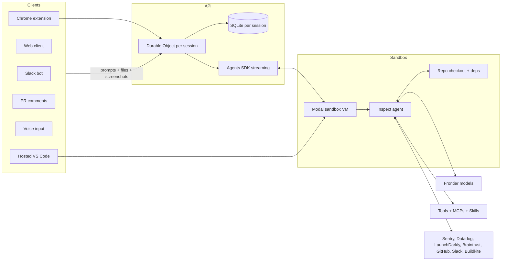
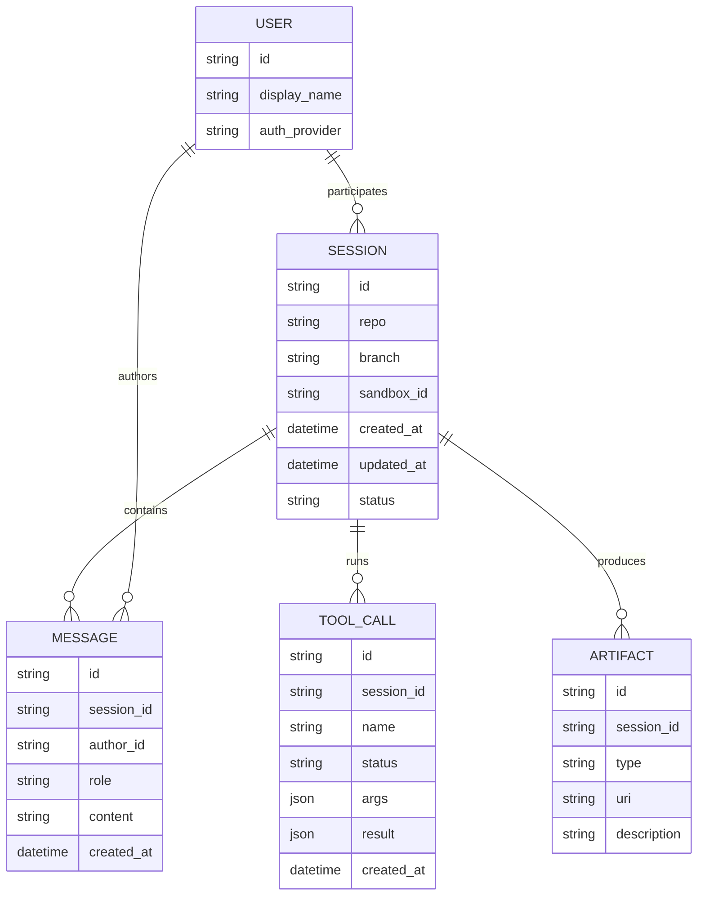
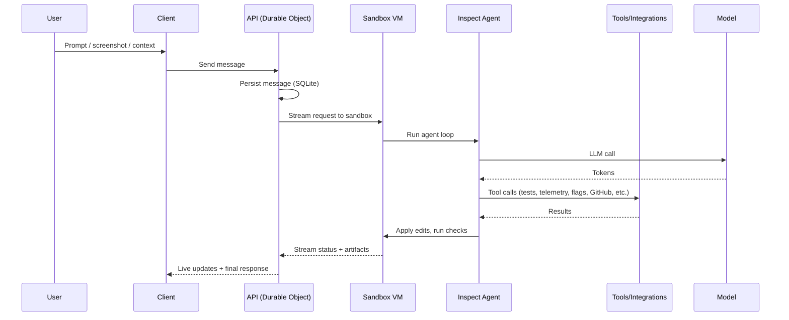
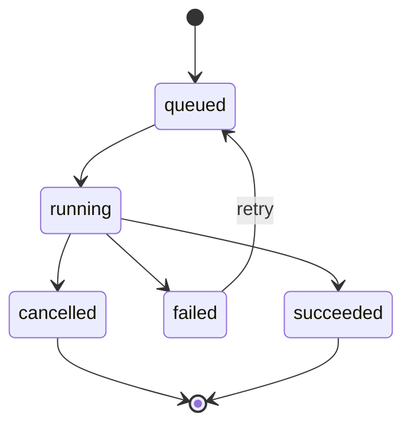
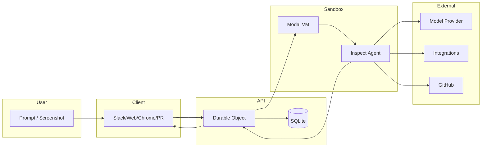

# Inspect Background Agent Architecture - Onboarding Doc

## TL;DR
Inspect is a hosted, background coding agent built around fast, isolated sandbox sessions that have a full dev environment and deep tooling integrations. The system is designed to feel like a local engineer workflow but with unlimited concurrency and rich client entry points (Slack, web, Chrome extension, PR comments, voice). This doc summarizes the architecture described in the Ramp Builders article and highlights areas that are explicit vs. unspecified.

## System Map
The system centers on a session-specific sandbox VM with a full dev environment and a real-time API layer that synchronizes state across clients.



## Core Data Model
The article describes session-scoped storage with Cloudflare Durable Objects and SQLite per session. The data model below is derived from that description.



Note: Field names are illustrative. The article specifies per-session SQLite storage and the need to attribute authorship in multiplayer mode, but does not provide a concrete schema.

## Message Lifecycle
1. User sends a prompt from any client (Slack, web, Chrome extension, PR comment, voice).
2. API receives the prompt and routes it to the session's Durable Object.
3. Session state is persisted in the per-session SQLite DB.
4. Agent runs in the sandbox VM and streams tokens back through the Agents SDK.
5. Agent reads code, runs tools/tests, and edits files in the sandbox repo.
6. Agent produces artifacts (screenshots, diff, PR branch, test results).
7. Changes are committed and pushed; API creates PR using the user's GitHub token.
8. Clients receive real-time updates and final status.

## Sequence: User -> Tool -> Response


## Tool System
### Tool Call Mapping
Tool calls are tracked through a lifecycle so the UI can show what the agent is doing and so failures are surfaced with context.



### How to Build a New Tool
The article recommends using OpenCode with its plugin system and mentions the `tool.execute.before` event hook to gate file edits until git sync completes. A canonical flow based on that description:

1. Define a tool contract (name, args, expected output) in the agent runtime.
2. Register the tool in the tool registry used by the agent loop.
3. Implement the server-side handler inside the sandbox runtime.
4. Add tool-specific auth/credentials (for integrations like Datadog or LaunchDarkly).
5. Add client-facing status updates (Slack/Web) to reflect running/complete states.
6. Gate unsafe tools until sandbox sync is complete using the pre-execution hook.

Example (illustrative) OpenCode plugin hook:

```ts
// Example shape only; confirm actual OpenCode SDK APIs
plugin.on("tool.execute.before", (ctx) => {
  if (!ctx.session.syncComplete && ctx.tool.isWrite) {
    throw new Error("Sandbox sync not finished; edits blocked");
  }
});
```

## Model Selection & System Prompting
The article states Inspect supports all frontier models, MCPs, custom tools, and skills. It does not specify a routing policy or system prompt strategy. Recommended documentation items to add in implementation:

- Model routing rules (manual user choice vs. automatic selection).
- Prompt assembly order (system -> repo context -> user prompt -> tool schema).
- Per-client prompt adapters (Slack vs. web vs. Chrome extension context).

## Context Window Management
The article does not specify token budgeting or context window limits. If implementing, document:

- Token counting strategy and model-specific limits.
- Early truncation strategy for large repos.
- How large artifacts (screenshots, DOM dumps) are summarized before prompts.

## Compaction
Compaction behavior is not described. If implemented, describe:

- Trigger condition (token threshold or time).
- Summary format stored in session DB.
- How summaries are rehydrated in later turns.

## Sessions & Threading
Key behaviors described in the article:

- Each session runs in its own sandboxed VM.
- Sessions are fast to start and effectively free to run, enabling unlimited concurrency.
- Follow-up prompts during execution are queued (not injected mid-run).
- Sessions can be resumed after a sandbox exits via snapshot restore.
- Multiplayer: multiple users can collaborate in the same session with authorship attribution.

## Failure Modes & Error Handling
The article does not list explicit failure handling, but the architecture implies the following must be covered:

- Sandbox startup failure (Modal image/snapshot missing or corrupted).
- Git sync failure (repo access token, network, merge conflicts).
- Tool failure (Sentry/Datadog/LaunchDarkly outages or auth issues).
- Model API errors (rate limits, timeouts).
- PR creation failures (GitHub token scope, webhook delivery).

## Swimlane: End-to-End Request


## Key Files to Read First
The article does not provide a codebase. If you are implementing this architecture, create and document files in these locations:

- `server/session/session_do.ts` - Durable Object for per-session state and streaming
- `server/session/session_db.ts` - SQLite schema and queries
- `server/api/router.ts` - Client ingress routing (Slack/Web/Chrome)
- `sandbox/agent/inspect.ts` - Agent loop and tool orchestration
- `sandbox/tools/registry.ts` - Tool registration and invocation
- `sandbox/tools/integrations/*` - Sentry/Datadog/LaunchDarkly/etc.
- `sandbox/git/worktree.ts` - Clone/sync/commit/push
- `clients/slack/bot.ts` - Slack bot + repository classifier
- `clients/web/*` - Web UI + streaming client
- `clients/chrome/*` - Extension sidebar + DOM capture

## Quick "What Lives Where"

| Area | Responsibility |
|------|----------------|
| `server/` | API ingress, session orchestration, streaming, auth |
| `server/session/` | Durable Objects + SQLite per session |
| `sandbox/` | Modal runtime, agent loop, repo operations |
| `sandbox/tools/` | Tool registry + integrations |
| `clients/` | Slack, web, Chrome extension, PR hooks |
| `infra/` | Image registry, snapshot builds, warm pool |

## Mental Model Cheat-Sheet
- A session is a durable, multi-client conversation with its own sandbox VM and SQLite state.
- The sandbox VM is pre-warmed from repository images built every ~30 minutes.
- All clients talk to the same session via Durable Objects and real-time streaming.
- The agent behaves like a local engineer: it can run tests, inspect telemetry, and edit code.
- PRs are opened using the user's GitHub token to preserve review integrity.
- Multiplayer is a first-class feature; authorship is tracked per message and code change.

---

## Architecture Details (from the article)

### Sandbox and Images
- Each session starts in an isolated sandbox VM with a full dev environment.
- Images are built per repository on a schedule; each image includes a cloned repo and preinstalled dependencies.
- The system snapshots a fully prepared image so sessions can start quickly.
- Sessions start from the latest snapshot; only recent changes need to sync.
- After a session finishes, another snapshot can be taken to resume later.

#### Performance Optimizations
- Warm the sandbox as soon as the user begins typing to reduce time-to-first-token.
- Keep a pool of warm sandboxes for high-volume repositories.
- Allow file reads before sync completion, but block writes until sync finishes.
- Shift as much work as possible into the image build step.

### Agent Runtime
- Inspect can run tests, inspect telemetry, and query feature flags.
- It integrates with Sentry, Datadog, LaunchDarkly, Braintrust, GitHub, Slack, and Buildkite.
- It supports all frontier models, MCPs, and custom tools/skills.
- It is designed to be limited only by model intelligence, not by missing tools or context.

### API Layer
- Cloudflare Durable Objects are used to provide per-session compute and state.
- Each session stores state in a per-session SQLite database.
- Streaming between sandbox, API, and clients is handled by Cloudflare's Agents SDK.

### GitHub Workflow
- Repo access uses a GitHub App installation token for cloning.
- Commits use updated git user.name/user.email values (since git operations are not user-bound).
- The sandbox pushes a branch and notifies the API with branch + session ID.
- The API creates the pull request using the user's GitHub token.
- Webhooks track PR updates, merges, and closures.

### Clients

#### Slack
- Slack is a primary workflow entry point and growth loop.
- A classifier selects the target repository using the message, thread context, and channel.
- The classifier uses a fast model with repo descriptions and common-case hints.
- The bot posts progress updates using Slack message tools and Block Kit.

#### Web
- The web client supports streaming updates and mobile access.
- Hosted VS Code runs inside the sandbox to allow manual edits.
- A streamed desktop view enables visual verification for web projects.
- The UI can attach before/after screenshots to PRs.
- A stats page tracks adoption and merges; live "humans prompting" is a useful metric.

#### Chrome Extension
- The extension allows visual edits on React apps.
- It captures DOM + React internals for the selected area to avoid large image payloads.
- Distribution can be done via managed device policy with a custom update server.

### Multi-Agent and Concurrency
- Sessions are effectively free to run, enabling parallel prompt explorations.
- The system supports tools to spawn child sessions and check their status.
- Follow-up prompts are queued and can be interrupted via a stop mechanism.

### Adoption Signal
- Internal usage reportedly reached ~30 percent of frontend and backend PRs within months.

---

## Gaps to Fill in an Implementation
The article does not specify these areas; capture them in your codebase docs:

- Exact message schema and storage tables.
- Tool registry interfaces and permission model.
- Model routing and prompt assembly logic.
- Token budgeting, truncation, and compaction.
- Error handling and retry policies for tools and models.
- Secrets management across sandbox and API.
- Access control for multiplayer sessions.

