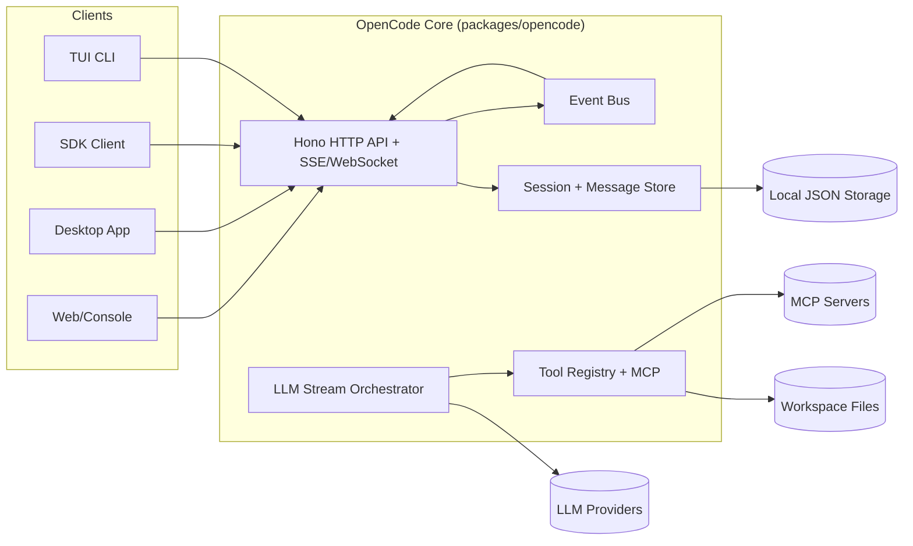
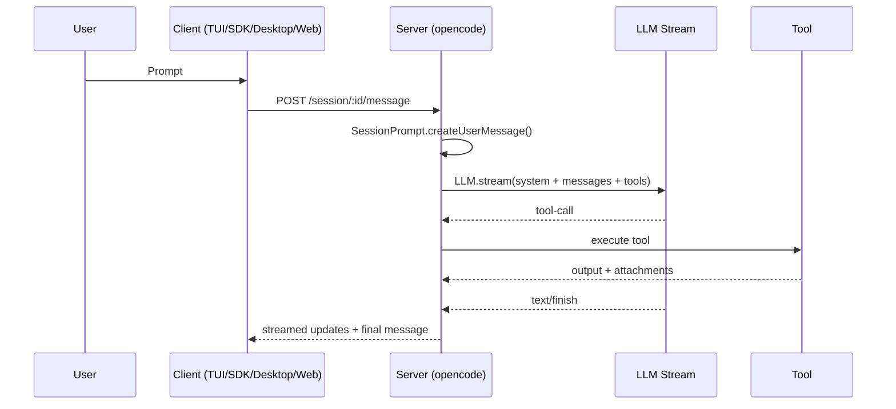
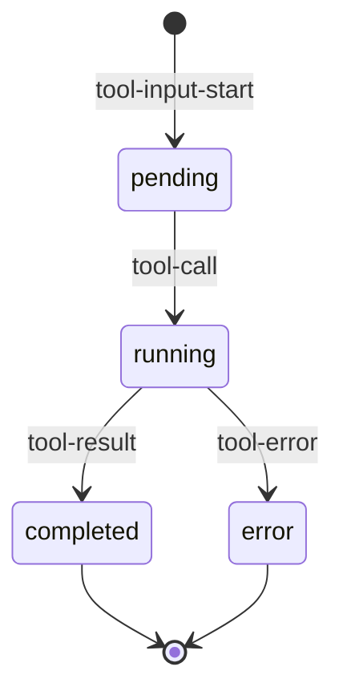
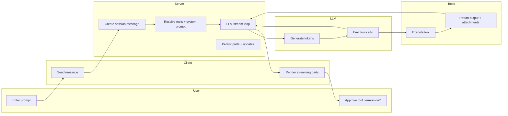
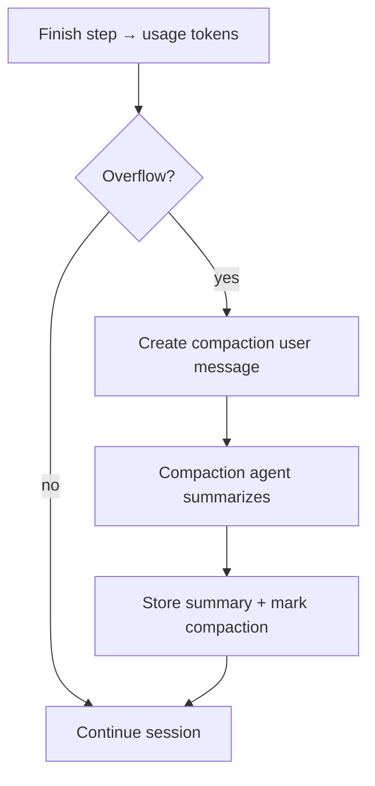

Hi Parker — great direction for learning this space. You’re building the right mental model.

# OpenCode Architecture — Onboarding + Agentic Systems Reference

## Overview
- Target repo: `.ai/refs/opencode` (OpenCode monorepo snapshot)
- Core idea: client/server AI coding agent with persistent sessions, tool registry, provider‑agnostic model layer, and context management via compaction
- Primary onboarding focus for agentic systems: `packages/opencode` (core runtime), `packages/plugin` (extensions), `packages/sdk` (API client), `packages/function` (sharing backend)

## Repo Map (big pieces, why they matter)
- `packages/opencode/` — core engine (CLI/TUI, server, session/message model, tool system, provider + prompt orchestration)
- `packages/plugin/` — plugin API and hooks for tools, auth, prompt transforms
- `packages/sdk/` — OpenAPI + generated JS SDK client
- `packages/function/` — Cloudflare Worker + Durable Object for session sharing/sync
- `packages/desktop/` — Tauri desktop wrapper around the UI
- `packages/console/`, `packages/web/` — web apps (console + marketing)
- `specs/` — design notes for APIs and perf (useful for onboarding context)

## Architecture (component view)


Key files:
- Entry + CLI commands: `packages/opencode/src/index.ts`
- HTTP API surface: `packages/opencode/src/server/server.ts`
- OpenAPI schema used by SDK: `packages/sdk/openapi.json`
- SDK client: `packages/sdk/js/src/client.ts`

## Core data model (sessions, messages, parts)
- Session = thread; supports parent/child, sharing, summary, permissions
  - `packages/opencode/src/session/index.ts` (Session.Info, create/fork, storage wiring)
- MessageV2 = atomic unit in a session; each message has parts
  - `packages/opencode/src/session/message-v2.ts`
- Parts are typed: `text`, `tool`, `reasoning`, `file`, `snapshot`, `patch`, `compaction`, `subtask`, `agent`
  - This gives rich UI + tool‑tracking semantics and future‑proofing
- Storage is local JSON under `Global.Path.data/storage`
  - `packages/opencode/src/storage/storage.ts`
  - `packages/opencode/src/global/index.ts`

## Message lifecycle (easy mental model)
1) User input becomes a `user` message with `text/file/agent` parts
2) Session loop assembles prompts + tools + system instructions
3) LLM stream emits tokens + tool calls
4) Tool calls update `tool` parts (pending → running → completed/error)
5) Assistant message is finalized, diffs/summaries computed

Key files:
- Prompt orchestration loop: `packages/opencode/src/session/prompt.ts`
- Stream event handling + part updates: `packages/opencode/src/session/processor.ts`
- Message → model conversion: `packages/opencode/src/session/message-v2.ts` (`toModelMessage`)

## Sequence: user → tool → response


## Tool call mapping (how tool state is tracked)
- Tool parts are first created as `pending` on `tool-input-start`
- Updated to `running` on `tool-call`
- Finalized to `completed` or `error` on `tool-result` / `tool-error`
- State lives in `MessageV2.ToolPart`, emitted on the Bus for UI updates

Key file:
- `packages/opencode/src/session/processor.ts` (tool call state machine)
- `packages/opencode/src/session/message-v2.ts` (ToolPart schema)

## Tool state chart


## Tools: how they’re built + registered
- Tool contract: `Tool.define(id, init)` returns schema + execute
  - `packages/opencode/src/tool/tool.ts`
- Tool registry builds tool list per agent + provider
  - `packages/opencode/src/tool/registry.ts`
- Built‑ins live in `packages/opencode/src/tool/*`
- Tools can be injected via:
  - plugins (`packages/plugin/src/index.ts`)
  - user config directories (`Config.directories()` in `packages/opencode/src/config/config.ts`)
  - MCP (`packages/opencode/src/mcp`)

Minimal tool shape (conceptual):
```ts
// packages/opencode/src/tool/tool.ts
Tool.define("my_tool", async () => ({
  description: "Do X",
  parameters: z.object({ foo: z.string() }),
  async execute(args, ctx) {
    return { title: "", metadata: {}, output: "result" }
  },
}))
```

## Subagents (task tool = thread spawner)
- Subagents are sessions created with `task` tool
- Tool enforces permissions, spins up new child session, streams results back
- Key files:
  - `packages/opencode/src/tool/task.ts`
  - `packages/opencode/src/agent/agent.ts`

## Swimlane: end‑to‑end request


## Model selection + system prompting (the “determination system”)
- Model selection priority:
  1) Explicit `input.model` passed to `SessionPrompt.prompt`
  2) Agent‑specific model config
  3) Last user model in session
  4) Provider default model
- Where it’s defined:
  - `packages/opencode/src/session/prompt.ts` (createUserMessage + lastModel)
  - `packages/opencode/src/agent/agent.ts` (agent defaults + overrides)
  - `packages/opencode/src/provider/provider.ts` (defaultModel, provider list)
  - `packages/opencode/src/config/config.ts` (user config + overrides)
- System prompt composition:
  - Provider‑specific prompt selection: `packages/opencode/src/session/system.ts`
  - Prompt text files: `packages/opencode/src/session/prompt/*.txt`
  - Local rule files are auto‑loaded (AGENTS.md, CLAUDE.md, etc)
  - Config `instructions` can include files or URLs
  - Plugins can mutate system via `"experimental.chat.system.transform"`
- Stream execution:
  - `packages/opencode/src/session/llm.ts`
  - Merges provider defaults + model options + agent options + variant
  - Uses `ai` SDK `streamText` with tool definitions
  - Applies `extractReasoningMiddleware` to track reasoning parts

## Context window management
Two layers:

1) Soft pruning of old tool outputs
- `SessionCompaction.prune` uses token estimates to blank older tool outputs
- Keeps last ~40k tokens of tool output; prunes older ones
- File: `packages/opencode/src/session/compaction.ts`

2) Compaction (hard context compression)
- Triggered when usage exceeds model context (`SessionCompaction.isOverflow`)
- Inserts a `compaction` part, runs compaction agent to summarize
- Uses plugin hook to extend/override compaction prompt
- File: `packages/opencode/src/session/compaction.ts`
- Summary stored as normal assistant message with `summary=true`
- Messages filtered for compaction boundaries in `MessageV2.filterCompacted`

## Compaction flow diagram


## Session summary + diff tracking
- Each assistant step captures a snapshot + patch
- `SessionSummary` computes diffs and per‑message titles
- Files:
  - `packages/opencode/src/session/summary.ts`
  - `packages/opencode/src/snapshot/index.ts`

## Sharing + sync
- Sharing uses a remote sync backend (Cloudflare Durable Object)
- Local share orchestration in `packages/opencode/src/share/*`
- Backend API in `packages/function/src/api.ts`
- This allows session sharing + live updates across clients

## How “threads” are modeled
- Thread = Session
- Child sessions = forks or subagent tasks (parentID)
- Forking clones messages up to a specific message ID
- Files:
  - `packages/opencode/src/session/index.ts` (create, fork, children)

## Key extension points
- Tool injection: `packages/opencode/src/tool/registry.ts`
- Plugin hooks:
  - `packages/plugin/src/index.ts`
  - `tool.execute.before/after`, `chat.message`, `chat.params`, `experimental.chat.system.transform`
- MCP tools:
  - `packages/opencode/src/mcp/*`
  - MCP tool results are converted into text + attachments in `SessionPrompt.resolveTools`

## Practical onboarding path (fast ramp)
- Core architecture: `packages/opencode/src/index.ts`
- Sessions + messages:
  - `packages/opencode/src/session/index.ts`
  - `packages/opencode/src/session/message-v2.ts`
  - `packages/opencode/src/session/prompt.ts`
  - `packages/opencode/src/session/processor.ts`
- Model + prompts:
  - `packages/opencode/src/session/llm.ts`
  - `packages/opencode/src/session/system.ts`
  - `packages/opencode/src/session/prompt/*.txt`
- Tools:
  - `packages/opencode/src/tool/tool.ts`
  - `packages/opencode/src/tool/registry.ts`
  - `packages/opencode/src/tool/*`
- Extensions + SDK:
  - `packages/plugin/src/index.ts`
  - `packages/sdk/openapi.json`
  - `packages/sdk/js/src/*`
- Context + compaction:
  - `packages/opencode/src/session/compaction.ts`
  - `packages/opencode/src/session/summary.ts`

## Mental model cheat‑sheet (plain English)
- A session is a thread. A message is a user/assistant turn. A part is a typed chunk of content (text, tool, file, etc).
- The prompt loop builds the system prompt + message history, resolves tools, then streams the model.
- Tool calls are first‑class parts with state; UI just watches those parts.
- Agents are configurations: permissions + prompts + model choices.
- Compaction happens when context is full: it summarizes and continues.
