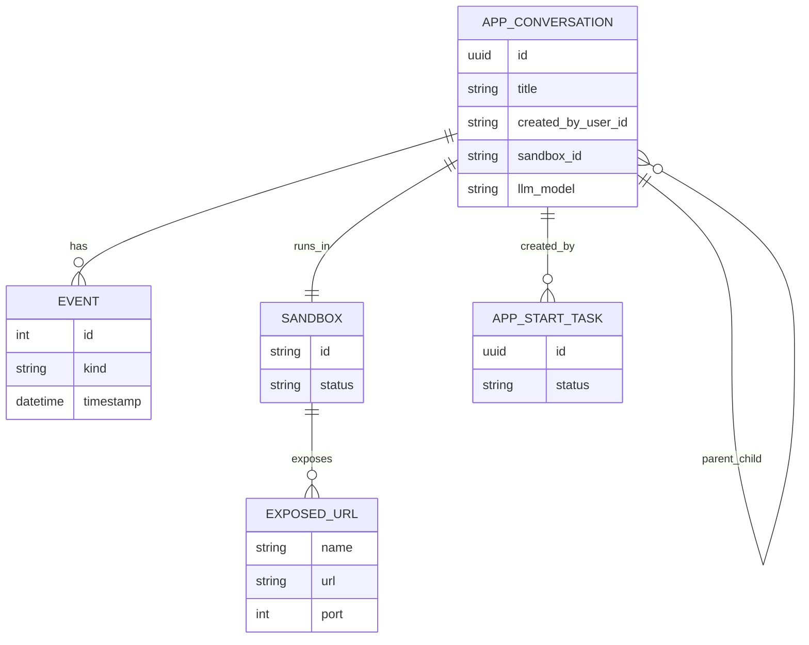
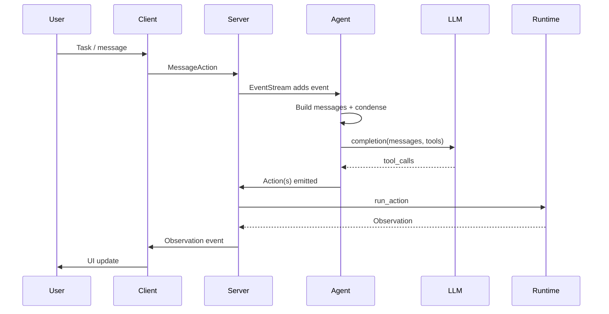
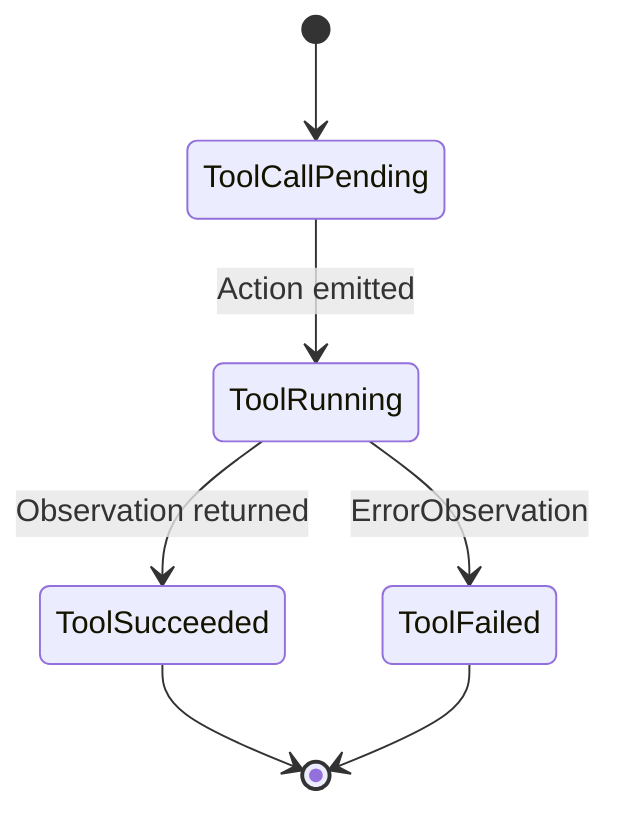
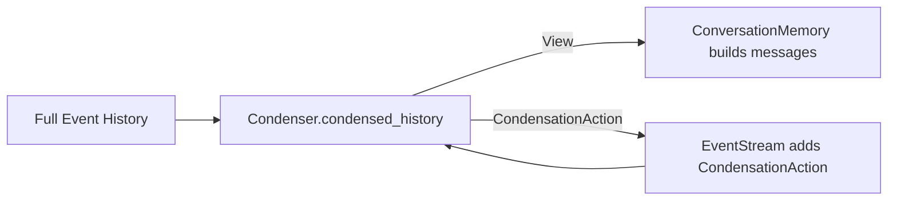
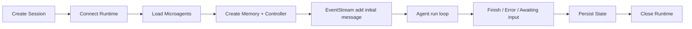
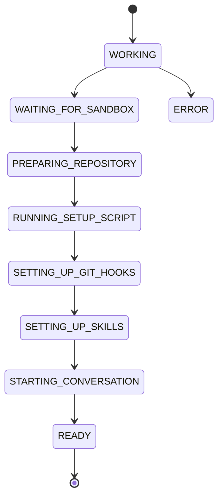
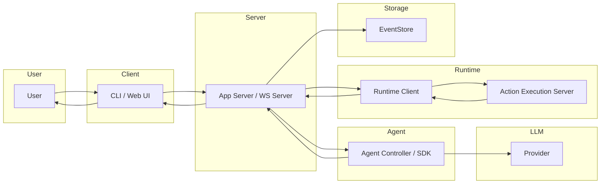

# OpenHands Architecture - Onboarding Doc

## TL;DR
OpenHands is a multi-surface agentic system with a legacy V0 runtime (agent controller + websocket server + docker/local runtimes) and a newer V1 app server that fronts an external Agent SDK / tools stack. In this repo you will find both the legacy agent core (Python, events, memory, runtime) and the V1 FastAPI app server that manages sandboxes, conversations, and event storage. The key mental model: user input becomes an Event -> AgentController / Agent -> LLM tool calls -> runtime actions -> observations -> persisted events and UI updates.

## System Map
```mermaid
flowchart LR
  subgraph Clients
    CLI[CLI]
    WebUI[Local Web UI]
    IDE[IDE/VSCode]
  end

  subgraph AppServerV1[App Server V1 (FastAPI)]
    V1Router[v1_router]
    AppConv[app_conversation]
    EventSvc[event service]
    SandboxSvc[sandbox service]
    UserSvc[user + jwt]
  end

  subgraph AgentCoreV1[Agent SDK / Tools (external)]
    SDK[openhands-sdk]
    Tools[openhands-tools]
    AgentServer[openhands-agent-server]
  end

  subgraph LegacyV0[Legacy V0 Core]
    ServerWS[server (websocket)]
    AgentCtl[controller + agenthub]
    Memory[memory + condenser]
    Events[event stream/store]
  end

  subgraph Runtime
    RuntimeClient[Runtime client]
    ActionExec[action_execution_server]
    Sandbox[Docker/Local/Remote]
  end

  LLM[LLM Providers]
  Store[FileStore / EventStore]

  Clients --> AppServerV1
  Clients --> ServerWS

  AppServerV1 --> SDK
  SDK --> AgentServer
  SDK --> Tools

  ServerWS --> AgentCtl
  AgentCtl --> Memory
  AgentCtl --> Events
  Memory --> Events

  AgentCtl --> LLM
  SDK --> LLM

  AgentCtl --> RuntimeClient
  RuntimeClient --> ActionExec
  ActionExec --> Sandbox

  Events --> Store
  AppServerV1 --> Store
```

Key files:
- V1 app server entry + routing: `openhands/openhands/app_server/v1_router.py`
- V1 conversation orchestration: `openhands/openhands/app_server/app_conversation/live_status_app_conversation_service.py`
- Legacy websocket server: `openhands/openhands/server/listen.py`
- Legacy controller/agent core: `openhands/openhands/controller/agent_controller.py`, `openhands/openhands/agenthub/codeact_agent/codeact_agent.py`

## Execution Environment
OpenHands supports multiple runtime execution environments, with the most common path being a Docker sandbox that runs an action execution server inside a container.

- Runtime abstraction: `openhands/openhands/runtime/base.py`
- Docker runtime client: `openhands/openhands/runtime/impl/docker/docker_runtime.py`
- Action execution server (runs inside sandbox): `openhands/openhands/runtime/action_execution_server.py`
- Remote / CLI runtimes: `openhands/openhands/runtime/impl/remote/`, `openhands/openhands/runtime/impl/cli/`

Execution flow (legacy V0):
1. Runtime client (host) connects and waits for the action execution server to become alive. `openhands/openhands/runtime/impl/docker/docker_runtime.py`
2. Agent actions are sent to the action execution server, which executes bash, file edits, browsing, Jupyter, etc. `openhands/openhands/runtime/action_execution_server.py`
3. Observations are returned and emitted as events. `openhands/openhands/runtime/base.py`

Sandbox lifecycle concepts:
- Runtime status states and startup phases: `openhands/openhands/runtime/runtime_status.py`
- Action execution server uses API key auth for sandbox access: `openhands/openhands/runtime/action_execution_server.py`

V1 sandbox service (app server side):
- Sandbox API models and status: `openhands/openhands/app_server/sandbox/sandbox_models.py`
- Sandbox service interface + polling to RUNNING: `openhands/openhands/app_server/sandbox/sandbox_service.py`
- Docker / remote / process implementations: `openhands/openhands/app_server/sandbox/`

## Core Data Model
There are two overlapping data models: legacy V0 (event stream + state) and V1 app server (conversations + sandboxes + start tasks).

Legacy V0 core entities:
- Event stream / store: `openhands/openhands/events/stream.py`, `openhands/openhands/events/event_store.py`
- State (agent runtime + history indices + metrics): `openhands/openhands/controller/state/state.py`
- Actions / Observations: `openhands/openhands/events/action/*`, `openhands/openhands/events/observation/*`

V1 app server entities:
- App conversation info/status: `openhands/openhands/app_server/app_conversation/app_conversation_models.py`
- Sandbox info: `openhands/openhands/app_server/sandbox/sandbox_models.py`
- Start task lifecycle: `openhands/openhands/app_server/app_conversation/app_conversation_models.py`

Entity relationship (simplified):


## Message Lifecycle
This is the legacy V0 path, which is still fully present and is the clearest source of agent lifecycle code in this repo.

1. User input arrives (CLI or websocket) and becomes a MessageAction.
   - CLI entry: `openhands/openhands/core/main.py`
   - Websocket server: `openhands/openhands/server/session/session.py`
2. Action is appended to the EventStream and persisted in FileStore.
   - Event stream: `openhands/openhands/events/stream.py`
3. AgentController watches events and decides when to step.
   - Controller: `openhands/openhands/controller/agent_controller.py`
4. Agent builds messages from event history, condenses if needed, and calls LLM.
   - CodeActAgent step: `openhands/openhands/agenthub/codeact_agent/codeact_agent.py`
   - Conversation memory: `openhands/openhands/memory/conversation_memory.py`
   - Condenser + View: `openhands/openhands/memory/condenser/condenser.py`, `openhands/openhands/memory/view.py`
5. LLM response (tool calls or text) is converted into Actions.
   - Tool call parsing: `openhands/openhands/agenthub/codeact_agent/function_calling.py`
6. Runtime executes actions and returns Observations.
   - Runtime dispatch: `openhands/openhands/runtime/base.py`
   - Action execution server: `openhands/openhands/runtime/action_execution_server.py`
7. Observations are added to EventStream and UI receives updates.
   - EventStream subscribers: `openhands/openhands/events/stream.py`
   - Websocket session push: `openhands/openhands/server/session/session.py`

## Sequence: User -> Tool -> Response


## Tool System
### Tool Call Mapping
Tools are described as function call schemas and mapped into OpenHands Actions.

Key pieces:
- Tool definitions (legacy): `openhands/openhands/agenthub/codeact_agent/tools/*`
- Tool list assembly: `openhands/openhands/agenthub/codeact_agent/codeact_agent.py`
- LLM tool call -> Action mapping: `openhands/openhands/agenthub/codeact_agent/function_calling.py`
- Runtime Action -> Observation: `openhands/openhands/runtime/base.py`, `openhands/openhands/runtime/action_execution_server.py`

Tool lifecycle (conceptual state):


Minimal tool schema example:
```python
from openhands.agenthub.codeact_agent.tools.bash import create_cmd_run_tool

# In CodeActAgent._get_tools()
tools = []
tools.append(create_cmd_run_tool())
```

Mapping into Actions:
```python
# openhands/openhands/agenthub/codeact_agent/function_calling.py
if tool_call.function.name == create_cmd_run_tool()["function"]["name"]:
    action = CmdRunAction(command=arguments["command"], is_input=is_input)
```

### How to Build a New Tool
This is the legacy (V0) flow. V1 tools are provided by the external `openhands-tools` package.

1. Define the tool schema (function name, parameters, description).
   - Example pattern: `openhands/openhands/agenthub/codeact_agent/tools/*.py`
2. Add the tool to the agent's tool list.
   - CodeActAgent tool list: `openhands/openhands/agenthub/codeact_agent/codeact_agent.py`
3. Map tool call -> Action in function_calling.
   - `openhands/openhands/agenthub/codeact_agent/function_calling.py`
4. Ensure the runtime can execute the Action and returns an Observation.
   - `openhands/openhands/runtime/base.py`
   - `openhands/openhands/runtime/action_execution_server.py`
5. Update memory formatting if the action/observation needs special handling.
   - `openhands/openhands/memory/conversation_memory.py`

## Model Selection & System Prompting
Legacy model selection is configured via LLMConfig and agent config mappings.

- LLM configuration + provider settings: `openhands/openhands/core/config/llm_config.py`, `openhands/openhands/llm/llm.py`
- Agent to LLM mapping: `openhands/openhands/llm/llm_registry.py`
- Model routing (multi-LLM): `openhands/openhands/llm/router/base.py`

System prompting flow (legacy):
- Prompt templates live alongside agent code: `openhands/openhands/agenthub/codeact_agent/prompts/`
- Prompt assembly + Jinja rendering: `openhands/openhands/utils/prompt.py`
- System message injection into event stream: `openhands/openhands/controller/agent.py`

V1 app server uses the external SDK for agent prompts and tools. The V1 server passes tool selections, LLM model, and conversation info into SDK calls.
- V1 integration entry: `openhands/openhands/app_server/app_conversation/live_status_app_conversation_service.py`

## Context Window Management
Key mechanisms:
- ConversationMemory builds LLM messages and filters large observations.
  - `openhands/openhands/memory/conversation_memory.py`
- LLM max_message_chars / prompt caching is applied in agent step.
  - `openhands/openhands/agenthub/codeact_agent/codeact_agent.py`
- Context window errors trigger condensation requests when enabled.
  - `openhands/openhands/controller/agent_controller.py`
- Condenser configuration controls how far back history is kept and summarized.
  - `openhands/openhands/core/config/condenser_config.py`

## Compaction
Compaction is implemented via the condenser framework. Condensers can return a reduced View or a CondensationAction.

- Condenser base and registry: `openhands/openhands/memory/condenser/condenser.py`
- Condenser implementations: `openhands/openhands/memory/condenser/impl/*`
- CondensationAction and CondensationRequestAction: `openhands/openhands/events/action/agent.py`
- View object inserts summaries and drops forgotten event IDs: `openhands/openhands/memory/view.py`

Compaction flow diagram:


## Sessions & Threading
Legacy V0 sessions:
- Websocket session wraps AgentSession and EventStream: `openhands/openhands/server/session/session.py`
- AgentSession owns runtime + controller + memory: `openhands/openhands/server/session/agent_session.py`
- Conversation metadata storage: `openhands/openhands/storage/conversation/`

V1 sessions:
- App server conversation APIs and status tracking: `openhands/openhands/app_server/app_conversation/`
- Event services for persistence and streaming: `openhands/openhands/app_server/event/`

Threading/concurrency:
- EventStream fan-out uses thread pools per subscriber: `openhands/openhands/events/stream.py`
- Background tasks in app server start tasks and sandbox polling: `openhands/openhands/app_server/app_conversation/live_status_app_conversation_service.py`

## Session Lifecycle
Legacy V0 lifecycle (approximate):


V1 app server lifecycle (approximate):
- Start task created -> sandbox starts -> repository prep -> hooks/skills -> conversation starts -> READY
  - Start task statuses: `openhands/openhands/app_server/app_conversation/app_conversation_models.py`
  - Sandbox startup polling: `openhands/openhands/app_server/sandbox/sandbox_service.py`

Lifecycle diagram (V1 start task):


## Collaboration / Multiplayer
Open source core supports parent/child conversations and conversation sharing at the data model level:
- Parent/sub conversation IDs: `openhands/openhands/app_server/app_conversation/app_conversation_models.py`

Multi-user RBAC, sharing, and collaboration are primarily in the enterprise directory (source-available):
- Enterprise services and integrations: `openhands/enterprise/`

## Clients & Surfaces
- CLI (separate repo, but wired here): `openhands/openhands-cli/` (submodule entry point)
- Local GUI: React frontend in `openhands/frontend/`
- Legacy websocket API: `openhands/openhands/server/listen.py`
- V1 REST API: `openhands/openhands/app_server/v1_router.py`
- VSCode integration support in runtime: `openhands/openhands/runtime/plugins/vscode/`

## AuthN/AuthZ + Git/PR Flow
V1 app server auth and JWT:
- JWT service: `openhands/openhands/app_server/services/jwt_service.py`
- User context + router: `openhands/openhands/app_server/user/*`

Legacy server auth (V0):
- User auth and middleware: `openhands/openhands/server/user_auth/`, `openhands/openhands/server/middleware.py`

Git provider integrations (tokens, repos, PRs, etc.):
- Provider abstraction: `openhands/openhands/integrations/provider.py`
- Provider-specific services: `openhands/openhands/integrations/github/`, `.../gitlab/`, `.../bitbucket/`
- Conversation metadata includes git provider + repo selection: `openhands/openhands/app_server/app_conversation/app_conversation_models.py`

## Failure Modes & Error Handling
Key patterns in the legacy core:
- LLM error handling, rate limits, and context window overflow: `openhands/openhands/controller/agent_controller.py`
- Tool call validation failures -> ErrorObservation: `openhands/openhands/agenthub/codeact_agent/function_calling.py`
- Runtime errors (disconnect, sandbox not found) surfaced via RuntimeStatus: `openhands/openhands/runtime/runtime_status.py`
- Action execution server input validation and file errors: `openhands/openhands/runtime/action_execution_server.py`

Common failure buckets:
- LLM provider failures (auth, rate limit, service unavailable)
- Context window overflow -> condensation request or fatal error
- Tool call schema mismatches
- Runtime disconnects / docker failures
- Sandbox resource limits (memory/timeouts)

## Swimlane: End-to-End Request


## Observability & Metrics
Legacy metrics:
- Token usage, cost, latency tracking: `openhands/openhands/llm/metrics.py`
- Conversation stats service: `openhands/openhands/server/services/conversation_stats.py`
- Monitoring extension point: `openhands/openhands/server/monitoring.py`

V1 event tracking:
- Event services and storage: `openhands/openhands/app_server/event/*`
- Event callbacks / webhooks: `openhands/openhands/app_server/event_callback/*`

## Cost & Performance Tradeoffs
- Docker runtime build vs reuse: runtime can build images on demand or attach to existing containers.
  - `openhands/openhands/runtime/impl/docker/docker_runtime.py`
- EventStream caches events in pages to reduce per-event reads.
  - `openhands/openhands/events/event_store.py`
- Condenser strategies trade accuracy for context length (recent-only, LLM summaries, attention).
  - `openhands/openhands/memory/condenser/impl/*`
- LLM provider routing and fallback adds overhead but can improve task success.
  - `openhands/openhands/llm/router/base.py`

## Key Files to Read First
- `openhands/openhands/agenthub/codeact_agent/codeact_agent.py` - main agent step loop, tools, LLM calls
- `openhands/openhands/controller/agent_controller.py` - event-driven control flow, error handling
- `openhands/openhands/events/stream.py` - event stream + persistence
- `openhands/openhands/memory/conversation_memory.py` - message assembly and tool call ordering
- `openhands/openhands/runtime/action_execution_server.py` - sandbox action execution
- `openhands/openhands/app_server/app_conversation/live_status_app_conversation_service.py` - V1 orchestration
- `openhands/openhands/app_server/sandbox/sandbox_service.py` - sandbox lifecycle and polling

## Quick "What Lives Where"
- `openhands/openhands/app_server/` - V1 app server (FastAPI), conversations, sandboxes, events, user/JWT
- `openhands/openhands/server/` - Legacy V0 websocket server and sessions
- `openhands/openhands/agenthub/` - Legacy agent implementations and prompts
- `openhands/openhands/controller/` - Agent controller, state, stuck detection
- `openhands/openhands/memory/` - Condensers + conversation memory
- `openhands/openhands/runtime/` - Runtime abstraction + docker/local/remote runtimes
- `openhands/openhands/events/` - Event types, stream, serialization
- `openhands/openhands/integrations/` - Git provider integrations
- `openhands/frontend/` - React UI
- `openhands/enterprise/` - Source-available enterprise extensions

## Mental Model Cheat-Sheet
- The agent does not read files directly; it emits Actions and receives Observations.
- EventStream is the backbone: everything (messages, tool results, state changes) becomes an Event.
- ConversationMemory translates events -> LLM messages, preserving tool call order.
- Condensers keep the context window under control; they may emit CondensationAction events.
- Runtime is a client to a sandboxed action execution server; this keeps the host safe.
- V1 app server orchestrates sandboxes + conversations but the agent core is external (SDK).
- Legacy V0 still contains the most complete local agent loop; V1 is a service wrapper around SDK.
