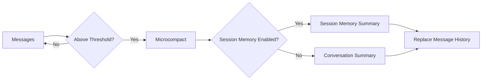

# Context Window and Compaction

Claude Code Open enforces token budgets and runs a multi-layer compaction
pipeline when needed.

## Context window management

- Token estimation: `src/context/index.ts`.
- Input/output budgets: `src/context/window.ts`.
- Reserved output budgets and thresholds set in the loop:
  `src/core/loop.ts`.
- Tool output persistence and truncation:
  `src/tools/output-persistence.ts`.

## Compaction pipeline

1) Microcompact clears older persisted tool outputs.
2) Conversation summary replaces historical messages with a summary block.
3) Session memory writes structured memory with a boundary UUID.

All stages are driven from `src/core/loop.ts`.

