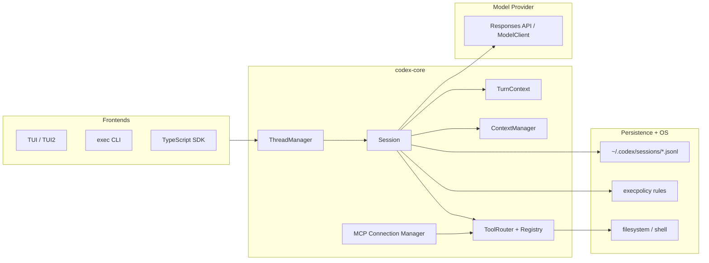

# Codex Architecture Docs (Manual)

TL;DR: This directory is a manual, per-subsystem breakdown of the Codex CLI codebase
(the Rust implementation inside the `codex` submodule). It focuses on the agent loop,
model prompting, tool routing, context/compaction, persistence, and safety. Paths
below are relative to the `codex/` submodule.

## Start here

- Repo map: `repo-map.md`
- Core runtime (threads, sessions, turns): `subsystems/core-runtime.md`
- Model selection + prompting: `subsystems/models-prompting.md`
- Tool system + plan tool: `subsystems/tools.md`
- Context window + compaction: `subsystems/context-compaction.md`
- Memory + persistence: `subsystems/persistence.md`
- Safety + failure modes: `subsystems/safety-failure-modes.md`
- Onboarding checklist + exercises: `onboarding.md`

## System overview

Agent loop in one sentence: a session receives user input, builds a prompt from
history plus instructions, asks the model to act, executes tool calls if requested,
records outputs back into history, and repeats until the turn ends.
