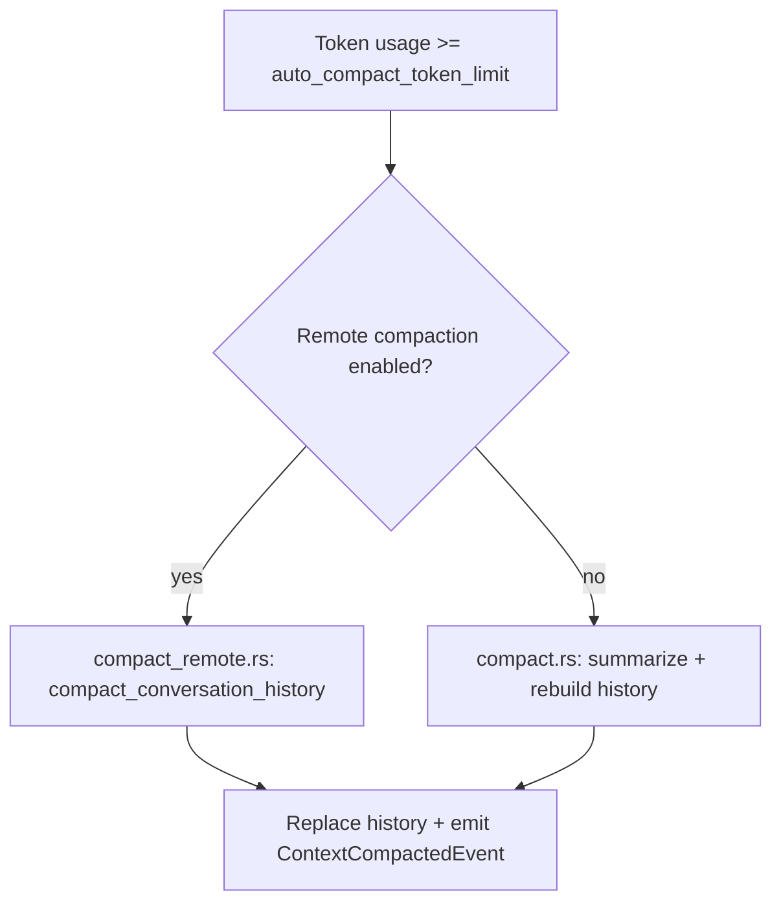

# Context Window and Compaction

This subsystem keeps model prompts within limits while preserving useful
history and tool results.

## Context window management

Context is managed explicitly and centrally. The system keeps the most useful
content in the model prompt while bounding tool outputs and history size.

### What happens to history

- `ContextManager` stores an ordered list of `ResponseItem`s.
- It normalizes call/output pairs and removes orphans.
- It tracks token usage (approximate) and can truncate tool outputs and messages.

Important files:

- `codex-rs/core/src/context_manager/history.rs`
- `codex-rs/core/src/truncate.rs`
- `codex-rs/core/src/state/session.rs`

### Truncation policy

- `TruncationPolicy` is model-dependent (tokens or bytes).
- Tool outputs are truncated when serialized for the model.
- Large tool outputs carry "truncated" markers.

Key paths:

- `codex-rs/core/src/truncate.rs`
- `codex-rs/core/src/tools/mod.rs` (formatting + truncation)
- `codex-rs/core/src/models_manager/model_info.rs` (config overrides)

## Compaction (auto + manual)

Compaction is Codex's summary-based memory reset to keep long threads usable.

### When compaction runs

- Manual: `Op::Compact` triggers a compact task.
- Auto: if `Session` token usage exceeds the model's `auto_compact_token_limit`.

Core control flow:

- `codex-rs/core/src/codex.rs` checks token usage in `run_turn` and calls
  `run_auto_compact`.
- `codex-rs/core/src/compact.rs` implements inline compaction via prompt + summary.
- `codex-rs/core/src/compact_remote.rs` implements remote compaction.

### Compaction flowchart

### What gets preserved

- Recent user messages plus a summary of earlier turns.
- Ghost snapshots (needed for `/undo`) are preserved.

Relevant code:

- `codex-rs/core/src/compact.rs` (`build_compacted_history`)
- `codex-rs/core/src/compact_remote.rs`
- `codex-rs/core/src/tasks/compact.rs`
