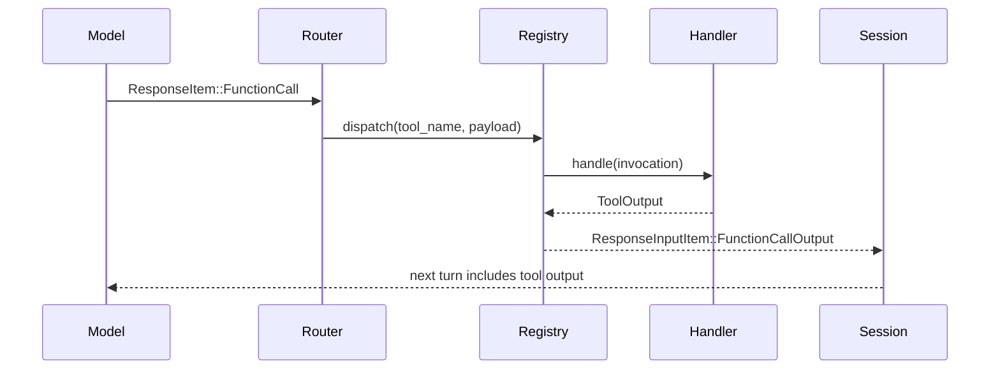

# Tool System (Specs, Routing, Execution)

Tools are declared as JSON-schema specs and registered with handlers. Model
outputs are normalized into tool calls and routed to handlers.

## Tool definition and registration

- `codex-rs/core/src/tools/spec.rs` - builds tool specs (shell, apply_patch, plan, MCP).
- `codex-rs/core/src/tools/registry.rs` - registers handlers and dispatches calls.
- `codex-rs/core/src/tools/handlers/` - concrete tool implementations.

Key examples:

- Shell: `codex-rs/core/src/tools/handlers/shell.rs`, `codex-rs/core/src/tools/runtimes/shell.rs`
- Apply patch: `codex-rs/core/src/tools/handlers/apply_patch.rs`
- Plan/todos: `codex-rs/core/src/tools/handlers/plan.rs`
- MCP passthrough: `codex-rs/core/src/tools/handlers/mcp.rs`, `codex-rs/core/src/mcp_connection_manager.rs`

## Tool call mapping (ResponseItem -> handler)

Model outputs produce `ResponseItem::FunctionCall`, `ResponseItem::CustomToolCall`,
or `ResponseItem::LocalShellCall`. These are converted into a normalized
`ToolCall` and dispatched.

- `codex-rs/core/src/tools/router.rs` - maps response items to `ToolCall`
- `codex-rs/core/src/tools/context.rs` - `ToolInvocation` (session + turn + call id)
- `codex-rs/core/src/tools/parallel.rs` - parallel tool call runtime with gating

## Tool call sequence diagram

## Adding a new built-in tool (recipe)

1) Add a ToolSpec in `tools/spec.rs` (JSON schema + description)
2) Implement a ToolHandler in `tools/handlers/` (parse args, run logic, return ToolOutput)
3) Register the handler and spec in `build_specs()` (same file)
4) Wire runtime if needed (for example shell-like tools in `tools/runtimes/`)
5) Add tests in relevant handler/spec tests

Tip: for MCP tools, you do not add code in core; they are discovered via MCP and
mapped automatically in `codex-rs/core/src/mcp_connection_manager.rs`.

## Structured plans/todos tool

Codex uses a simple structured tool to capture plans/todos so UIs can render a
checklist. The tool is not for the model's own memory; it is for UI-visible plan
state.

- Tool spec + handler: `codex-rs/core/src/tools/handlers/plan.rs`
- Events: `codex-rs/protocol/src/plan_tool.rs` + `protocol.rs` (PlanUpdate events)

The `update_plan` tool accepts a list of steps (`pending`, `in_progress`,
`completed`) and emits an event that frontends can render.
